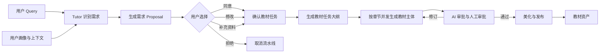

# 教材生产流水线设计

> **性质**：领域设计。定义业务流程、节点契约、状态与数据边界；不覆盖具体实现细节。

## 1. 设计目标

用户先说明学习需求，Tutor 识别缺口并提出可确认方案；用户确认后，系统生成教材任务大纲，再按章节并发生成教材主体，经过 AI 审批和人工审批，最后完成美化与发布。

核心原则：

- Tutor 负责识别需求和生成方案，不直接生成最终教材。
- 用户确认是流水线的关键边界，修改和补充需求必须形成新的任务版本。
- 大纲是后续章节生成的明确输入和验收标准。
- 章节生成与美化都必须保留版本、节点调用记录、当前状态和可追溯的产物。
- 目前先实现教材生产，不将知识卡片混入教材流水线。

## 2. 用户旅程



## 3. 三段式与五阶段设计

### 3.1 第一阶段：需求识别与方案确认

#### 输入

- 用户 Query
- 用户画像
- 当前学习上下文
- 已有教材、知识卡片或学习记录
- 当前可用的知识点与课程结构

#### Tutor 行为

1. 判断用户是否存在明确的学习缺口或生成需求。
2. 判断是否需要生成教材、知识卡片或两者。
3. 说明预计生成的内容、范围、知识点和资源。
4. 给出可直接修改的方案。
5. 不得直接假设用户同意；必须通过用户确认进入下一阶段。

#### Proposal 结构

```json
{
  "proposalId": "proposal-xxx",
  "requestId": "request-xxx",
  "summary": "用户需要补充前端性能和浏览器渲染知识",
  "neededArtifacts": ["textbook", "knowledge-card"],
  "expectedScope": {
    "knowledgePoints": ["渲染性能", "网络请求", "缓存策略"],
    "chapterCount": 4,
    "resourceTypes": ["markdown", "exercise"]
  },
  "options": [
    { "id": "approve", "label": "同意", "value": "approved" },
    { "id": "modify", "label": "修改需求", "value": "modified" },
    { "id": "add-context", "label": "补充资料", "value": "add-context" },
    { "id": "decline", "label": "拒绝", "value": "declined" }
  ],
  "status": "awaiting-user-confirmation"
}
```

#### 用户操作

- 同意：进入教材任务确认。
- 修改：更新需求字段并重新生成 Proposal。
- 补充：加入资料或约束后重新生成 Proposal。
- 拒绝：结束当前流水线，不 создавать教材。

### 3.2 第二阶段：教材任务大纲

第二阶段维护的是教材的**学习结构**，不是知识点实体。它由三个不同层次的数据组成：

#### 运行输入：`OutlineContext`

`OutlineContext` 是一次 outline 能力调用的临时上下文，由业务层根据已确认任务和结构化学习画像构建。它只进入模型输入，不作为大纲产物保存：

```json
{
  "brief": {
    "title": "前端性能优化",
    "goal": "理解渲染性能、网络请求与缓存策略",
    "scope": ["浏览器渲染", "网络请求", "缓存"]
  },
  "learnerProfile": {
    "version": 3,
    "primaryTech": [
      { "name": "TypeScript", "level": "熟练", "note": "组件与状态管理" }
    ],
    "techStack": [
      { "name": "TypeScript", "level": "熟练", "note": "组件与状态管理" },
      { "name": "React", "level": "熟练", "note": "页面开发" },
      { "name": "Vite", "level": "会用" }
    ],
    "education": "本科，计算机科学与技术专业。",
    "profession": "前端工程师，中级。",
    "learned": ["组件与状态管理", "构建工具配置"],
    "goals": ["掌握浏览器渲染与网络性能优化"],
    "preferences": ["示例先行"],
    "extras": []
  }
}
```

`OutlineContext` 不包含 `briefId`、`markdownVersionId`、`contentHash` 或知识点实体 ID。来源版本和哈希属于调用溯源元数据，由画像解析与运行记录维护。

#### `learnerProfile` 的职责与字段定位

`learnerProfile` 不是用户原始画像的替代品，也不是能力测评结果或知识地图。它是从画像 Markdown 提取出的、供教学决策使用的结构化事实集合，主要回答：

- 学习者已经明确掌握或接触过哪些技术与主题？
- 已知技术的水平档位是什么？
- 哪个方向是主线，哪些方向只能作为支线？
- 哪些背景、目标和偏好会影响大纲的难度、范围、案例和练习？

解析器只提取原文明确表达的事实，不根据技术名称、职业或上下文推断水平。`learnerProfile` 不负责创建知识点、不负责计算分数，也不记录学习行为统计。

当前结构化 JSON 的字段定位如下：

| 字段 | 职责 | 合理性与使用边界 |
|---|---|---|
| `version` | 结构化画像 schema 版本 | 必须保留；它是数据契约版本，不是学习者水平。 |
| `primaryTech` | 需精通的主修技术 | 主修是大纲主线选择的锚点；它是 `techStack` 的子集，同一技术允许两处同时出现。 |
| `techStack` | 已知技术的全量清单，含条目级水平 | 核心字段；起点难度由条目级 `level` 决定。 |
| `education` | 学业背景 | 一个字符串，保留原文表述；不拆成固定的学历 / 专业 / 院校子字段。用于决定术语深度和前置知识，不用于推断技术水平。 |
| `profession` | 职业背景 | 一个字符串，保留原文表述；用于选择工作场景和案例边界，不用于推断技术熟练度。 |
| `learned` | 已学内容 | 字符串数组，每条一个已覆盖的主题或范围；用于避免重复讲，但「学过」不等于「掌握」。 |
| `goals` | 学习目标 | 字符串数组，每条一个目标；必须保留，用于确定大纲范围与验收方向。目标不是知识点清单。 |
| `preferences` | 学习形式与节奏 | 字符串数组，每条一个偏好；用于决定章节粒度和活动形式，不应改变事实范围或降低验收标准。 |
| `extras` | 未命中受控分区的原文 | 保留以避免信息丢失，但默认不作为 outline 的决策输入。 |

每个分区用与内容相称的最简类型：技术是条目数组（`name` / 可选 `level` / 可选 `note`），学业与职业是一个字符串，已学内容与目标、偏好是字符串数组；分区缺失写 `null`。不用 `present` / `text` / `items` 三层包装：缺失可直接读取，分区原文留在权威 Markdown，不随解析产物重复存储。背景也不定固定子字段 —— 用户换一种写法就会解析失败，或让解析器把一句话拆成它并不确定的字段。薄弱点和感兴趣不进结构化画像：前者随学习持续变化、在画像里无法可靠追踪，后者与「学习目标」重复。

outline 注入时以 `primaryTech` 定位主线，以 `techStack` 的条目级水平决定起点难度；用 `learned` 避免重复讲已覆盖的主题；用 `education`、`profession`、`preferences` 调整深度、案例与形式；用 `goals` 限定覆盖边界；不得把 `extras` 直接当作能力事实。

#### 模型输出：`OutlineDraft`

`OutlineDraft` 是模型根据 `OutlineContext` 生成的、尚未审批的结构化大纲草稿。它描述主题和章节关系，不负责创建知识点实体：

```json
{
  "title": "前端性能优化学习大纲",
  "coveredOutcomeIds": ["outcome-rendering"],
  "pendingConfirmation": [],
  "items": [
    {
      "title": "性能指标与优化目标",
      "summary": "建立性能指标和优化目标的共同语言",
      "buildsOn": [],
      "learningTasks": ["能够解释核心性能指标的含义"],
      "acceptanceCriteria": ["能够根据场景选择合适的指标"],
      "children": []
    }
  ]
}
```

草稿不得包含 `briefId`、`knowledgePointIds` 或知识点实体对象，也不包含大纲或节点的标识：**身份由系统在入库时分配**。章节需要引用其它章节时按标题引用，由调用方解析成标识并校验唯一性。`title` 是学习结构的业务描述，不是知识地图中的节点引用；不确定的主题必须进入 `pendingConfirmation`。

#### 持久化产物：`OutlineVersion`

用户确认并通过契约校验后，`OutlineDraft` 才形成 `OutlineVersion`。`OutlineVersion` 负责版本、状态、审批和节点产物的持久化身份：大纲与节点的标识在这里分配，不由模型生成。工作流可以在外层元数据中关联已确认的任务版本，但该关联不属于大纲模型契约，也不进入大纲节点字段。

章节节点只能消费 `OutlineVersion.items` 中的章节主题、学习任务、依赖和验收标准。知识点实体、知识点 ID、来源节点和版本由后续美化阶段创建并挂接到教材产物，不写回原始 `OutlineDraft`。

### 3.3 第三阶段：教材主体生成

#### 输入

- 已确认的教材任务大纲
- 用户画像与上下文
- 章节主题
- 已有教材版本或同主题资料

#### 输出

- 每章生成独立 Markdown 内容
- 每章包含可追溯的调用记录
- 每章包含生成状态和版本
- 章节内容必须保持一致的术语和格式

#### 并发规则

- 每个章节使用独立节点运行。
- 节点之间不共享未完成的临时状态。
- 章节生成可以并发，但所有章节必须使用相同的大纲版本。
- 章节生成失败时只影响对应章节，不应影响其他章节。
- 章节输出必须通过契约校验，再进入审核阶段。

### 3.4 第四阶段：审批与修订

#### AI 审批

检查：

- 是否符合大纲章节和知识点
- 是否存在事实不一致
- 是否存在重复或遗漏
- 是否符合目标用户水平
- 是否存在结构、格式或引用问题

#### 人工审批

用户可以选择：

- 通过
- 修改内容
- 提出问题
- 请求重新生成
- 直接请求重新审阅

审核结果必然产生新的版本。原版本仍可保留，避免丢失历史。

#### 修订规则

- 修改后的内容形成新版本。
- 每次修订必须记录修改来源和审批状态。
- 修订节点不能直接覆盖已批准的旧版本。
- 失败的修订可以重试，但必须保持最大尝试次数和重试策略。

### 3.5 第五阶段：美化与发布

美化阶段负责统一格式、提升可读性和可用性：

- Markdown 层级与排版
- 公式、表格、调用卡片
- 示例与可执行代码
- 章节导航和目录
- 练习、答案解析与引用
- 课程元数据与版本信息

发布前完成：

- 大纲与正文是否一致
- 所有章节是否存在
- 每章是否通过审批
- 资源引用是否有效
- 生成日志和版本是否完整
- 是否存在未解决的质量问题

## 4. 流水线状态机

```text
created
  ↓
awaiting-user-confirmation
  ├─ declined → cancelled
  ├─ modified → proposal-revised
  └─ approved → outline-created

outline-created
  ↓
chapters-running
  ├─ one chapter failed → chapter-failed
  └─ all chapters succeeded → awaiting-review

awaiting-review
  ├─ approved → awaiting-human-approval
  └─ revision-requested → chapters-revisioning

chapters-revisioning
  ↓
awaiting-human-approval
  ├─ approved → beautification-running
  ├─ rejected → chapters-revisioning
  └─ changed → chapters-revisioning

beautification-running
  ↓
awaiting-publication
  ↓
published
```

## 5. 节点契约

### 5.1 Tutor 需求识别节点

- 节点 ID：`tutor-requirement`
- 类型：`agent`
- 输入：用户 Query、用户画像、上下文
- 输出：`proposal`
- Prompt：需求识别模板
- 角色：`tutor`
- 状态：等待用户确认

### 5.2 任务确认节点

- 节点 ID：`task-confirmation`
- 类型：`human-gate`
- 输入：Proposal
- 输出：`approved-task`、`revised-task`、`rejection`
- 状态：等待人工审批

### 5.3 教材大纲节点

- 节点 ID：`textbook-outline`
- 类型：`agent`
- 输入：`OutlineContext`
- 输出：`OutlineDraft`；审批通过后持久化为 `OutlineVersion`
- Prompt：教材大纲模板
- 角色：`outline-architect`
- 消息入口：`build_messages(capability="outline", context=context)`
- 业务解析：`capabilities/outline/messages.py` 负责将已确认任务和结构化学习画像转换为 `OutlineContext`
- 不生成 `briefId`、`knowledgePointIds` 或知识点实体

### 5.4 章节生成节点

- 节点 ID：`chapter-writer:<chapter-id>`
- 类型：`agent`
- 输入：大纲版本、章节主题、学习任务、依赖、验收标准和上下文
- 输出：`chapter-version`
- Prompt：章节写作模板
- 角色：`section-writer`

### 5.5 审批节点

- 节点 ID：`chapter-review:<chapter-id>`
- 类型：`review`
- 输入：章节版本、章节大纲、约束
- 输出：`review-report`、`approved-chapter`
- Prompt：章节审校模板
- 角色：`reviewer`

### 5.6 修订节点

- 节点 ID：`chapter-revision:<chapter-id>`
- 类型：`agent`
- 输入：章节版本、审校报告、用户意见
- 输出：`revised-chapter-version`
- Prompt：章节修订模板
- 角色：`reviser`

### 5.7 美化与发布节点

- 节点 ID：`textbook-beautifier`
- 类型：`agent`
- 输入：已批准章节与大纲
- 输出：`beautified-textbook`
- Prompt：美化模板
- 角色：`beautifier`

## 6. 端口与产物约束

每个节点应声明输入输出端口。端口类型必须一致，才能建立安全的图连接：

| 端口 | 类型 | 说明 |
|---|---|---|
| `proposal` | `Proposal` | Tutor 生成的需求方案 |
| `approved-task` | `TextbookTask` | 用户确认后的任务 |
| `outline` | `OutlineVersion` | 结构化教材大纲 |
| `chapter` | `ChapterVersion` | 单个章节内容 |
| `review-report` | `ReviewReport` | AI 审批结果 |
| `revised-chapter` | `ChapterVersion` | 修订后的章节 |
| `beautified-textbook` | `TextbookVersion` | 美化后的教材 |

连接时必须检查：

- 源端口存在
- 目标端口存在
- 产物类型一致
- 输入是否为必需
- 是否允许多值
- 节点是否允许接收空值

## 7. 可追溯要求

每个任务运行必须保留：

- 工作流运行 ID
- 大纲版本 ID
- 节点 ID
- 节点运行 ID
- Prompt Ref 与模板版本
- 输入绑定与变量值
- LLM 调用记录
- 节点输出产物版本
- 审批结果
- 用户确认记录
- 当前状态和时间戳

不可在前端只保存可见状态，也不可通过前端 mock 产生真实的运行证据。

## 8. 首个最小可用版本

当前最小切片不需要实现完整发布系统，先完成：

```text
用户 Query
  ↓
Tutor 生成 Proposal
  ↓
用户确认
  ↓
生成教材大纲
  ↓
按章节生成 Markdown
  ↓
AI 审批
  ↓
人工确认
  ↓
美化
```

该切片的验收标准：

1. Proposal 具有明确的当前状态和用户操作。
2. 用户确认后生成结构化大纲。
3. 大纲版本能被后端保存并读取。
4. 每个章节都能形成独立的版本和调用记录。
5. 审批结果能映射到对应章节。
6. 美化后的教材能保持可追溯的版本关系。
7. 前端只读取后端事件，不自行伪造节点状态。

## 9. 技术分层

- **业务层**：定义节点、确认、审批、版本和状态。
- **Workflow 层**：负责固定流程与节点装配，不包含通用执行器。
- **Capability 层**：负责单一输入到输出的任务能力。
- **API 层**：提供工作流、Proposal、Outline、章节与运行记录接口。
- **Persistence 层**：负责 SQLite 结构和版本化数据。
- **Frontend 层**：负责展示图、状态和可追溯信息，不负责决定业务流程。

## 10. 未决定事项

- 是否允许用户在 Proposal 中直接调整章节数量。
- 是否将知识卡片作为同一流水线的可选输出。
- 是否允许章节生成并发到具体的并发数。
- 是否支持用户在审批阶段直接修改章节。
- 是否支持自动生成出题与参考答案。
- 是否将美化与发布拆分为独立节点。

这些事项不影响当前最小切片，但必须在进入对应功能前明确契约。
