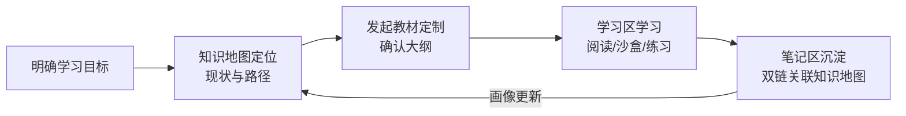
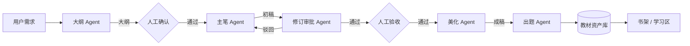

# PRD

> **性质**：业务需求唯一权威。确定业务方向，不含任何技术实现。

## 产品定位与愿景

**一句话定位**：面向 IT 学习者的多智能体学习陪伴助手——以知识图谱为骨架、AI 生成教材为内容供给、本地化笔记为个人资产沉淀，支撑长期学习运营。

| 维度 | 定义 |
|---|---|
| 目标用户 | IT 从业者与进阶学习者（自驱型，需要体系化学习路径） |
| 核心价值 | ① 体系化：知识网络而非碎片信息；② 个性化：教材按需生成、按画像定制；③ 资产化：笔记与学习记录长期沉淀、可运营 |
| 产品形态 | 本地优先的 **Windows 桌面应用**（学习工作台，数据与笔记存于本机，无需部署服务器） |

## 用户画像与场景

### 目标用户特征

- 有明确学习目标（如转岗、补强技术栈、备考），需要体系化路径而非随机检索。
- 有笔记习惯，重视个人知识资产的可积累与可复用。
- 对 AI 生成内容持审慎态度，需要可控的审校环节。

### 核心使用旅程

## 功能需求

### 知识地图（Knowledge Map）

以图网络呈现 IT 知识体系：知识点为节点，先修/包含/关联关系为边。

- 知识图谱可视化浏览：缩放、聚焦、按领域过滤
- 知识图谱构建：Agent 从教材与笔记中抽取知识点与关系，人工可修正
- 学习者定位：在图谱上标注已完成/学习中/未开始状态
- 学习路径规划：基于图谱拓扑推荐先修序列
- 笔记双链注入：笔记内链接同步为图谱边

### 教材书架（Bookshelf）

拟真书本展示 AI 产出的教材，按学科与学习进度排列。

- 书架视图：拟真书本卡片，展示学科/章节规模/进度
- 教材元数据管理：学科、章节树、版本、生成状态
- 教材生命周期状态：生成中 / 待验收 / 已发布 / 归档

### 学习区（Learning Zone）

教材内容阅读与交互学习。

- 教材内容阅读器：章节导航、目录、阅读进度
- 代码沙盒：浏览器内即时运行与结果展示（一期限浏览器原生语言）
- 练习题：客观题自动判分；代码题以测试用例判分
- 自测与错题回顾：按知识点聚合练习记录

### 教师 Agent（Tutor Agent）

常驻学习区旁的实时辅导智能体，跟踪用户学习行为并即时响应。

- 行为跟踪：持续感知用户在学习区的行为（阅读位置、停留、练习作答、错误模式）
- 即时响应：基于行为上下文主动提示或答疑（如检测到反复出错时介入讲解）
- 抽屉式对话窗口：可从侧边展开为对话面板，与学习内容并排交互，不打断学习流
- 上下文感知：对话可引用当前阅读的教材章节、练习记录与笔记内容
- 模型热更新：教师大模型支持不中断服务地在线替换与版本切换
- 提示词策略集：预置多套提示词方案，按情境动态选用（如答疑、纠错、鼓励、路径建议等场景各配专属提示词）
- 画像驱动：教师 Agent 持续维护用户画像，随交互逐步完善；画像不量化打分，但明确总结用户的技术栈与当前水平，作为个性化辅导依据

### 笔记区（Notes）

类 Obsidian 的本地 Markdown 笔记工作台。

- Markdown 编辑器：语法高亮、实时预览
- 双链（wikilink）：`[[链接]]` 语法、反向链接面板
- 本地文件管理：仓库式目录、全文检索
- 笔记库（vault）：指向用户指定的本地目录，应用直接读写
- 笔记图谱视图：以图网络呈现笔记关联
- 笔记 → 教材素材：笔记可作为教材生成的输入上下文

> **说明**：Obsidian 客户端为闭源软件，不可直接复用；交互对标其体验，编辑器内核采用开源方案（技术选型归 Arch.md）。

### Agent 教材生产线（Content Pipeline）

多角色智能体协作流水线，产出结构化教材。角色链：大纲 → 主笔 → 修订审批 → 美化 → 出题。

- 大纲生成：按用户学习目标与用户画像产出章节大纲
- 人工确认节点：大纲确认与终稿验收（Human-in-the-loop）；大纲生成后展示给用户，用户可提示、修改后再确认
- 主笔编写：按大纲逐章产出内容
- 修订审批：Agent 审校初稿，驳回重写或通过
- 内容美化：排版、示例补充、图示建议
- 出题：按章节生成练习题与答案解析
- 提示词资产化：角色提示词版本化存储，可回溯
- 调用全量日志：每次 Agent 调用记录完整提示词、响应与元数据（token、耗时），供离线优化
- 生产线可观测：前端呈现生成进度与各角色产出状态

### 用户画像与长期运营（Profile & Retention）

- 学习行为记录：阅读进度、练习成绩、笔记活跃度
- 用户画像构建：由教师 Agent 持续维护，随交互逐步完善；不量化打分，但明确总结技术栈与当前水平
- 画像消费：推荐学习路径、定制教材选题、支撑教师 Agent 个性化辅导；同时引导教材大纲设计
- 画像可见可编辑：用户可查看自身画像，并手动修改

> 一期策略：画像数据只积累不消费（画像构建后置，行为记录先行落地）。

## 边界与非目标

- 不做多人协作与社区功能（单用户本地优先）。
- 不做通用聊天助手；Agent 能力均服务于教材生产与学习辅导场景。
- 不做移动端应用。
- 桌面端本期只支持 Windows，不做 macOS / Linux 版本。
- 不承诺 AI 生成内容的绝对正确性；以人工验收节点兜底。

## 约束

- 数据本地化：笔记与教材资产存储于本地，不上传第三方。
- 可追溯：教材内容须能回溯到生成它的 Agent 调用日志。
- 成本可控：Agent 调用须有日志计量，支持按角色统计 token 消耗。

