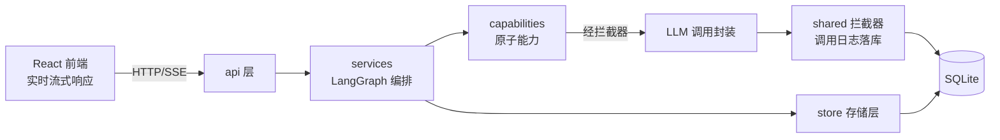

# 后端基建设施：SQL / LLM / Log

## 一、业务背景与目标

### 业务问题

后端业务功能（教材生产线、教师 Agent）尚未开工，需要先落地三项基础设施，保证后续业务代码有统一的存储、模型调用与日志底座：

1. **SQL（SQLite 存储层）**：教材资产、调用日志、用户画像、行为记录的持久化。提示词**不入库**，由 `prompts/*.md` + git 管理。
2. **LLM**：模型调用封装 + LLM settings（运行时解析、支持教师 Agent 模型热更新）。
3. **Log（调用日志拦截器）**：所有 LLM 调用经 `shared` 拦截器统一落库（token/耗时/提示词版本），角色代码零侵入。

### 已确认需求

- **实时性口径**：前端实时响应（流式），后端不做实时响应（无 WS 推送、无后台轮询任务；后端只在请求-响应周期内工作）。
- **改代码先整理到 Task.md**：任何代码改动先在本文件整理方案，经确认后再动手。

### 目标

1. SQLite 存储层可用：连接管理、幂等迁移、基础表结构。
2. LLM 调用封装可用：按当前 settings 实例化客户端，支持热更新。
3. 调用日志拦截器可用：每次 LLM 调用自动落库，业务代码零侵入。

## 二、当前业务工作流（mermaid）



## 三、审查结论

- `store/`、`config/`、`shared/`、`capabilities/` 等目录已建但为空，本轮填充。
- 已落盘 `store/database.py`（连接管理 + 迁移框架 + 初始 schema：llm_settings / prompt_versions / call_logs / textbooks / user_profiles / behavior_logs）与 `constants/__init__.py`（AgentRole / TextbookStatus 枚举）——**待确认后保留或调整**。
- 设计文档无具体表结构 DDL，本轮表结构为首次落地，需确认字段。
- 依赖已具备：langchain（LLM 封装）、fastapi；SQLite 用标准库，无新增依赖。

### 重构审查（T1–T4 落地后复查）

按「测试先行 / contracts 先行 / 命名不加编号」三条哲学复查当前实现，问题清单如下：

| # | 问题 | 依据 | 影响 |
|---|---|---|---|
| R1 | `store/database.py` 是**废弃草稿**，与 `store/sqlite/database.py` 重复，且含已废弃的 `api_key`/`base_url` 列 | 文件内容对比 | 双份真相，误用即错 |
| R2 | `config/llm_settings.py` 直接读写 SQLite 表 | `Arch.md`：`capabilities` 依赖 `config/constants/shared`，不直接访问 store；分层为 `api → services → capabilities/store` | config 层被污染为「带副作用的持久化层」 |
| R3 | `get_settings()` 读取时若不存在则 INSERT（getter 写库） | 副作用隐藏 | 只读路径产生写事务；并发下语义不清 |
| R4 | `schemas/` 六个 `*Row` 类**无消费方**（仅用到 `TABLE` 常量） | YAGNI | 超前设计，维护成本无人受益 |
| R5 | `shared/llm_interceptor.py` 职责过载：env 无关、客户端构建、usage 归一、日志拼装、落库混于一体 | 单一职责 | 难测试、换 provider 需改核心 |
| R6 | `_load_env_file()` 手写 `.env` 解析 | 重复造轮子 | 引号/转义/注释边界易错 |
| R7 | `DB_PATH` 用 `parents[4]` 硬编码层级 | 路径脆弱 | 目录调整即断 |
| R8 | `api/main.py` 未触发迁移 | 无 lifespan | 启动后表不存在 |
| R9 | `scripts/verify_infra.py` 不是测试 | AGENTS.md「测试先行」 | 验证不可回归、无 CI 价值 |
| R10 | `store/__init__.py` 同时导出 `database` 模块与同名函数族 | 入口不唯一 | 两套调用路径 |
| R11 | `llm_settings.role` 为裸字符串，`AgentRole` 枚举未被使用 | contracts 未闭环 | 契约空转，拼写错误无保护 |
| R12 | 无 pytest / lint 配置 | AGENTS.md「测试先行」 | 无自动化质量门 |

### 二次审查（T5 重构后复查，用户指出）

| # | 问题 | 依据 | 影响 |
|---|---|---|---|
| R13 | `schemas/` **语义错位**：目录名为「schema」，装的却是行类型；真 DDL 在 `scripts/init.sql` | 名实不符 | 概念混淆，读者无法判断谁是权威 |
| R14 | **三份真相互不校验**：`init.sql` DDL ／ `COLUMNS` 元组 ／ TypedDict 键，各写一遍 | 无交叉校验 | 漂移不可发现 |
| R15 | **行契约零消费方**：6 个 TypedDict 与 6 处 `COLUMNS` 全仓无引用（`rg` 取证：仅 `TABLE` 被用） | YAGNI（重犯 R4） | 死代码，维护成本无人受益 |
| R16 | `get_settings()` **两分支形状不一致**：命中 DB 返回 6 键，默认分支返回 4 键；`LlmSettings` 契约声明 6 键必填 | Liskov／契约失真 | 契约是假的，且因无人使用而永不被发现 |
| R17 | **提示词内容入 SQL**（`prompt_versions` 表存 role/version/content） | git 已是版本库，且有 diff/blame/review；SQLite 副本无法审阅 | 用错存储形态：文档资产当关系数据存 |


## 四、非目标

- 不实现业务功能（教材生成、教师对话流）。
- 不做 Neo4j 知识地图存储（后续任务）。
- 不做后端实时推送（WS / 后台任务队列）。
- 不做提示词内容本身：提示词为 `prompts/*.md` 文档资产（git 版本化），不进 SQL；`constants/` 亦不提供提示词。

## 五、待确认问题与风险

1. [已确认] **数据库选型**：SQLite（WAL 模式）。理由：单用户本地工具、零部署、`app.py` 一键启动兼容、标准库零依赖；未来多人云端部署再迁 PostgreSQL（store 层 SQL 保持标准写法）。
2. [已确认] **表结构组织**：`store/sqlite/schemas/` 每表一个模块（表名/字段常量 + 行模型），`store/sqlite/scripts/` 放 DDL `.sql` 脚本，`database.py` 作连接管理 + 迁移执行器（按文件名顺序幂等执行 scripts）。
3. [已确认] **LLM 配置来源**：API Key 从系统环境变量读取（不落库）；URL 放 `.env`（已 gitignore）；代码内置默认模型配置列表并标记默认模型；用户喜好 temperature 存 `llm_settings` 表，可修改、随调用生效。
   - **API Key 两级间接**（已确认）：`.env` 存的是**变量名**而非密钥本体，读取链为「`.env` → `API_KEY_NAME` → 系统环境变量名 → 取密钥值」：
     ```
     .env:  OPENCODE_BASE_URL=https://opencode.ai/zen/go/v1
            API_KEY_NAME=OPENCODE_API_KEY
     读取:  API_KEY_NAME  →  "OPENCODE_API_KEY"  →  os.environ["OPENCODE_API_KEY"]  →  密钥值
     ```
     好处：`.env` 不含敏感值（可放宽分享与排查），密钥本体只存在于系统环境变量；切换 provider 只改一行变量名。
   - **BASE_URL 键名**：当前 `.env` 实为 `OPENCODE_BASE_URL`（非早前设想的 `LLM_BASE_URL`），实现按实际键名读取；多 provider 时再演进为 `{PROVIDER}_BASE_URL`。
4. [已确认] **拦截器实现方式**：自封装 invoke 包装函数（方案 B）。核心优势：每次调用现读 settings → 热更新零成本；日志逻辑完全可控、异常落库路径明确。流式版本 `stream_llm` 在后续 SSE 任务时补充。
5. [已确认] **SSE 后置**：本轮基建不含流式接口，教师对话流式归后续业务任务。
6. [已确认] **LLM 调用的编排归属**：取 **B —— `services/llm.py`**。services 是唯一可同时依赖 store + capabilities + shared 的层；`shared/llm_interceptor.py` 退化为纯日志写入器（上下文管理器，成功/异常均落库）。`capabilities/llm_client.py` 仅负责建客户端与归一 usage。
7. [已确认] **`schemas/` 契约形态**：取 **`TypedDict`** —— 纯类型零行为，契约有独立落点，且 `dict` 可直接消费。
8. [已确认] **依赖引入**：引入 `pytest`（dev，落实测试先行）；`.env` 解析**手写**（不引 `python-dotenv`，当前仅两行配置，手写 8 行即可覆盖且零依赖）。
9. [待确认] **是否引入 `ruff`**（格式 + lint + import 排序）：可选，若同意则加 `[tool.ruff]` 并跑一次全量格式化。**本轮未做，保持现状。**
10. [已确认] **`data/teacheragent.db` 移出版本库**：改为 gitignore（`data/*` + `!data/.gitkeep`），已 `git rm --cached`。
11. [已确认] **提示词改由文件管理**（R17）：`prompts/*.md`，git 承担版本与回溯；删除 `prompt_versions` 表；`call_logs.prompt_version_id` → `prompt_ref`（存 `prompts/<role>.md` 相对路径）。
12. [已确认] **`schemas/` 改名 `tables/`**（R13）：语义为「表行契约」；`scripts/*.sql` 为 DDL 唯一权威。
13. [待确认] **迁移策略**：项目未发布，`init.sql` 允许直接修改（配合删除本地 `data/teacheragent.db` 重建）；**首次发布后一律新增脚本、不再改动已应用脚本**。是否认可该分界线？

## 六、已确认口径

1. **前端实时响应，后端不实时响应**：前端流式呈现；后端无 WS 推送、无后台轮询，仅请求-响应周期内工作。
2. **改代码先整理到 Task.md**：方案落盘本文件，确认后再行动。
3. **数据库用 SQLite**（WAL），非 PostgreSQL；迁移路径预留（标准 SQL 写法）。
4. **LLM 配置三层来源**：Key=系统环境变量（经 `.env` 的 `API_KEY_NAME` 两级间接取得）、URL=`.env`、模型列表+默认模型=代码内置、temperature=llm_settings 表（用户喜好）。
5. **LLM 调用唯一入口 = `services.llm.invoke_llm`**：读配置（store 仓储）→ 建客户端（capabilities）→ 拦截器计时落库（shared）。`shared/llm_interceptor.intercept` 为上下文管理器，成功与异常路径均写 `call_logs`，异常照常上抛。
6. 技术栈沿用：SQLite（标准库 sqlite3）+ LangChain + FastAPI。
7. 分层依赖：`api → services → capabilities / store`；`capabilities → config / constants / shared`；`config` 不得依赖 `store`（由 `tests/test_layering.py` 强制）。
8. **契约形态**：表契约用 `TypedDict`（`store/sqlite/schemas/`）；包内 `__init__.py` 只做汇总导出，不承载定义。
9. **测试先行**：验收断言落 `tests/`（pytest），`uv run pytest` 为任务完成判据。

无阻塞项。

## 七、实施任务与依赖

### T1. SQLite 存储层（重构为 schemas/scripts 结构）

**意义**：所有持久化数据的统一底座。

**状态**：【已完成。`store/sqlite/{database.py, schemas/, scripts/}` 结构落地，6 张表 + 幂等迁移执行器】

**范围**：`store/sqlite/database.py`（get_connection / migrate / query / execute）、`store/sqlite/schemas/`（llm_settings / prompt_versions / call_logs / textbooks / user_profiles / behavior_logs）、`store/sqlite/scripts/*.sql`、`constants/__init__.py`（AgentRole / TextbookStatus）

**验收**：`migrate()` 幂等可重复执行；建表后可读写。

**验证结果**：连续两次 migrate + 插入/查询 llm_settings 成功。

### T2. LLM settings 与调用封装

**意义**：模型调用统一入口，支持教师 Agent 模型热更新。

**状态**：【已完成。`config/llm_settings.py`：内置 DEFAULT_MODELS（默认 gpt-4o-mini）、.env 读 LLM_BASE_URL、系统环境变量读 API Key、llm_settings 表存模型与 temperature】

**范围**：`config/` 内置默认模型配置列表（含默认项）+ 读 `.env`（LLM_BASE_URL）+ 读系统环境变量（API Key）+ 读 `llm_settings` 表（当前选用模型、temperature）；提供 settings 读取与更新函数。

**验收**：修改 temperature 或切换模型后，下一次调用即生效，无需重启。

**验证结果**：get_settings 自动初始化默认项；update_settings(temperature=0.3) 后立即生效。

### T3. 调用日志拦截器

**意义**：调用全量日志（PRD：可追溯、按角色统计 token）。

**状态**：【已完成。`shared/llm_interceptor.py` 的 invoke_llm：现读 settings → 实例化客户端 → 调用 → 落库；客户端构建也纳入 try，任何异常均落库后 re-raise】

**范围**：`shared/llm_interceptor.py`：`invoke_llm(role, messages, prompt_version_id=None)` → 现读 settings → 实例化客户端 → 调用 → 写 `call_logs`（input/output/token/耗时/状态），异常也落库后 re-raise。

**验收**：任意角色调用 LLM 后 `call_logs` 自动出现记录，业务代码无日志代码。

**验证结果**：无 API Key 时调用抛 OpenAIError，call_logs 出现 status=error 记录（含耗时）。

### T4. 验证与提交

**意义**：基建可用性验证。

**状态**：【已完成。`scripts/verify_infra.py` 端到端通过；提交 ec9fca7】

**范围**：迁移幂等 + 模拟调用 + 日志落库端到端验证；git commit。

**验收**：端到端脚本通过。

**验证结果**：verify_infra.py 四项断言全部通过（迁移幂等 / 热更新 / 异常落库 / 日志可查）。

### T5. 第一轮实现重构（消除 R1–R12）

**意义**：把 T1–T4 的「能跑」升级为「分层正确、契约闭环、可回归测试」。

**状态**：【已完成。T5.1–T5.9 全部落地，提交 `ceabc2e`】

**范围与拆分**（每项对应 R 编号）：

| 子项 | 内容 | 对应 |
|---|---|---|
| T5.1 | 删除废弃草稿 `store/database.py` | R1 |
| T5.2 | 抽出 `store/sqlite/repositories/`：`llm_settings.py`（settings 持久化，get 无副作用 + upsert）、`call_logs.py`（日志写入 + 按角色计数）；`config` 层去副作用 | R2 R3 R5 |
| T5.3 | `config/` 拆分为 `paths.py`（pyproject 标记定位项目根）、`env.py`（手写 `.env` 解析 + `API_KEY_NAME` 两级间接 + BASE_URL）、`llm_catalog.py`（模型候选 + 默认项 + 默认 temperature） | R2 R6 R7 |
| T5.4 | `schemas/` 契约改为 `TypedDict`（6 表） | R4 |
| T5.5 | 编排归位：`services/llm.py` 提供 `invoke_llm`；`shared/llm_interceptor.py` 退化为纯日志写入器（`intercept` 上下文管理器） | R5 |
| T5.6 | `api/main.py` 加 lifespan → `migrate()` | R8 |
| T5.7 | `scripts/verify_infra.py` 迁移为 `tests/` 下 pytest 用例（30 项） | R9 R12 |
| T5.8 | `store/__init__.py` 收敛为唯一入口；`role` 参数统一接受 `AgentRole` | R10 R11 |
| T5.9 | `data/teacheragent.db` 移出版本库（gitignore + `.gitkeep`） | — |
| 附加 | 新增 `tests/test_layering.py`：静态强制「config 不依赖 store」与「`__init__.py` 不承载定义」 | 防回归 |

**契约：`config/env.py`**（API Key 两级间接）

```python
def get_env(key: str, default: str = "") -> str
    """读配置项（先 .env，后系统环境变量）。"""

def get_api_key_name() -> str
    """读 .env 的 API_KEY_NAME，得到「存密钥的那个环境变量名」。"""

def get_api_key() -> str
    """两级间接：.env 的 API_KEY_NAME → 系统环境变量名 → os.environ[名] → 密钥值。"""

def get_base_url() -> str
    """读 .env 的 OPENCODE_BASE_URL。"""
```

边界：任一级缺失（`.env` 无 `API_KEY_NAME`、或该名在系统环境变量中不存在）均返回空串，不抛异常；调用方在 `invoke_llm` 内由 provider 层报错，并照常落 `call_logs`（status=error）。

**已落地结构**：

```
src/teacheragent/
├── api/main.py                  # FastAPI 入口 + lifespan(migrate)
├── config/
│   ├── paths.py                 # 项目根 / DB_PATH 集中
│   ├── env.py                   # .env 加载 + 环境变量读取
│   └── llm_catalog.py           # 模型候选 + 默认项 + 默认 temperature（纯常量）
├── constants/{roles,textbook}.py
├── capabilities/llm_client.py   # build_client(settings)：按配置实例化
├── services/llm.py              # invoke_llm 编排：读 settings → 建客户端 → 计时 → 落库
├── shared/llm_interceptor.py    # 纯日志写入器（依赖 store，无编排）
└── store/sqlite/
    ├── database.py              # 连接 + migrate + query/execute
    ├── schemas/                 # 行契约（TypedDict）
    ├── repositories/            # llm_settings / call_logs
    └── scripts/init.sql

tests/
├── conftest.py                  # 临时 DB fixture（隔离 data/）
├── test_migrate.py              # 迁移幂等 + 建表/索引/WAL
├── test_llm_settings.py         # 默认读取无副作用 + upsert + 角色隔离
├── test_env.py                  # API Key 两级间接 + 边界缺失
├── test_interceptor.py          # 成功/异常双路径落库
├── test_llm_service.py          # 编排全链路（假客户端，不触网）+ 热更新
├── test_paths.py                # 项目根定位
└── test_layering.py             # 分层约束（config 不依赖 store）
```

**验收**：`uv run pytest` 全绿；`rg "from teacheragent.store" src/teacheragent/config` 无结果（config 无 store 依赖）；`migrate()` 幂等；无重复文件。

**验证结果**：【已完成，提交 `ceabc2e`】
- `uv run pytest -q` → **30 passed in 0.74s**
- `rg "teacheragent.store" src/teacheragent/config` → 无匹配（由 `test_layering.py` 静态强制）
- 废弃草稿 `store/database.py`、旧 `config/llm_settings.py`、`scripts/verify_infra.py` 均已删除
- `data/teacheragent.db` 已 `git rm --cached`，`.gitignore` 改为 `data/*` + `!data/.gitkeep`
- 应用可导入：`from teacheragent.api.main import app` → `TeacherAgent API`

### T6. 消除死代码与契约失真，提示词改为文件管理（消除 R13–R17）

**意义**：T5 重构后仍存在「契约是假的、死代码、存储形态用错」三类缺陷，本轮收口。核心原则：**契约必须有消费方、且必须被强制校验；文档资产不进 SQL**。

**状态**：【已完成。T6.1–T6.9 全部落地】

**范围与拆分**：

| 子项 | 内容 | 对应 |
|---|---|---|
| T6.1 | `store/sqlite/schemas/` → `store/sqlite/tables/`（语义：表行契约）；`scripts/*.sql` 为 DDL 唯一权威 | R13 |
| T6.2 | 删除 `COLUMNS` 常量（第三份真相 + 死代码，rg 取证 0 消费方） | R14 R15 |
| T6.3 | 行契约**只保留有仓储消费方的表**：`LlmSettingsRow`、`CallLogRow`，并由仓储返回类型真实引用；删除 `prompt_versions` / `textbooks` / `user_profiles` / `behavior_logs` 四个无人消费的行契约（结构留在 `init.sql`，等有仓储再建） | R15 |
| T6.4 | 有效配置契约 `LlmSettings`（4 字段：role/provider/model/temperature）与行契约 `LlmSettingsRow`（6 字段）**分离**；`get_settings()` 两分支统一投影为 4 字段，不再泄漏 `id`/`updated_at` | R16 |
| T6.5 | **提示词改为文件**：新建 `prompts/<role>.md`（`teacher` / `curriculum` / `knowledge_map`）+ `prompts/README.md` 记录命名与引用约定；删除 `init.sql` 的 `prompt_versions` 表 | R17 |
| T6.6 | `call_logs.prompt_version_id` → `prompt_ref TEXT`（存 `prompts/<role>.md` 相对路径） | R17 |
| T6.7 | 新增 `tests/test_table_contracts.py`：以 `PRAGMA table_info` 的列名与顺序 **有序** 对比 `XxxRow.__annotations__` 键，契约与 DDL 漂移立即失败 | R14 |
| T6.8 | 删除本地 `data/teacheragent.db` 重建（未发布，`init.sql` 可直接改）；在 `prompts/README.md` 或 `store/sqlite/scripts/` 注记迁移分界线 | 迁移策略 |
| T6.9 | 同步 `src/teacheragent/README.md`（表数量、提示词来源、tables 目录语义） | 文档一致 |

**目标结构变更**：

```
prompts/                          # 新增：提示词资产（git 承担版本与回溯）
├── README.md                     # 命名与引用约定
├── teacher.md
├── curriculum.md
└── knowledge_map.md

src/teacheragent/
├── config/
│   └── llm.py                    # 由 llm_catalog.py 改名：候选清单 + 默认值 + LlmSettings（有效配置契约）
└── store/sqlite/
    ├── tables/                   # 由 schemas/ 改名：表行契约（仅保留有消费方的）
    │   ├── llm_settings.py       # TABLE + LlmSettingsRow（6 字段）
    │   └── call_logs.py          # TABLE + CallLogRow（prompt_ref 取代 prompt_version_id）
    └── scripts/init.sql          # DDL 唯一权威（5 表，删除 prompt_versions）
```

**验收**：
- `uv run pytest` 全绿，含新增契约漂移与形状一致性断言
- `rg "COLUMNS" src` / `rg "prompt_versions" src` / `rg "prompt_version_id" src` / `rg "schemas" src` → **均无结果**
- `LlmSettings` 键集合 = `['role', 'provider', 'model', 'temperature']`；`get_settings()` 两分支同形（由测试断言）
- 本地 `data/teacheragent.db` 已删除，由 `migrate()` 按新 `init.sql` 重建（5 表）
- 应用可导入：`from teacheragent.api.main import app` → `TeacherAgent API`

**验证结果**：【已完成】
- `uv run pytest -q` → **39 passed in 0.77s**（新增契约漂移与形状一致性断言）
- `rg "COLUMNS" src` / `rg "prompt_versions" src` / `rg "prompt_version_id" src` / `rg "schemas" src` → **均无结果**
- `LlmSettings` 键集合 = `['role', 'provider', 'model', 'temperature']`；`get_settings()` 两分支同形（由测试断言）
- 本地 `data/teacheragent.db` 已删除，由 `migrate()` 按新 `init.sql` 重建（5 表）
- 应用可导入：`from teacheragent.api.main import app` → `TeacherAgent API`

## 八、推荐执行顺序

T1 → T2 → T3 → T4（已完成，提交 `ec9fca7`）→ T5.1 → … → T5.9（已完成，提交 `ceabc2e`）→ **T6.1 → … → T6.9（待 Q13 确认）**。

**当前阻断点**：Q13（迁移分界线）。确认后一次性执行 T6.1–T6.9。

后续候选方向（待新任务规划）：

1. **SSE 流式接口**：`services/llm.py` 补 `stream_llm`，拦截器支持流式用量累计。
2. **提示词装配**：`prompts/*.md` 的加载/渲染能力（待有真实业务流消费方时再建，避免重犯 R15）。
3. **知识地图**：Neo4j 接入（节点/边、先修关系、笔记双链注入）。
4. **前后端联通**：`api/` 暴露 settings 读写与模型候选清单。
5. **用户画像与行为记录**：画像构建（不量化打分）、行为记录先行积累。

另一悬置项：Q9（是否引入 `ruff` 做格式与 lint），不影响当前交付。