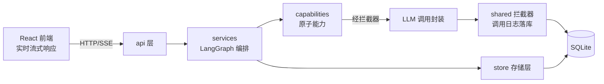

# 后端基建设施：SQL / LLM / Log

## 一、业务背景与目标

### 业务问题

后端业务功能（教材生产线、教师 Agent）尚未开工，需要先落地三项基础设施，保证后续业务代码有统一的存储、模型调用与日志底座：

1. **SQL（SQLite 存储层）**：教材资产、调用日志、用户画像、行为记录、提示词版本的持久化。
2. **LLM**：模型调用封装 + LLM settings（运行时解析、支持教师 Agent 模型热更新）。
3. **Log（调用日志拦截器）**：所有 LLM 调用经 `shared` 拦截器统一落库（token/耗时/提示词版本），角色代码零侵入。

### 已确认需求

- **实时性口径**：前端实时响应（流式），后端不做实时响应（无 WS 推送、无后台轮询任务；后端只在请求-响应周期内工作）。
- **改代码先整理到 Task.md**：任何代码改动先在本文件整理方案，经确认后再动手。

### 目标

1. SQLite 存储层可用：连接管理、幂等迁移、基础表结构。
2. LLM 调用封装可用：按当前 settings 实例化客户端，支持热更新。
3. 调用日志拦截器可用：每次 LLM 调用自动落库，业务代码零侵入。

## 二、当前业务工作流（mermaid）

## 三、审查结论

- `store/`、`config/`、`shared/`、`capabilities/` 等目录已建但为空，本轮填充。
- 已落盘 `store/database.py`（连接管理 + 迁移框架 + 初始 schema：llm_settings / prompt_versions / call_logs / textbooks / user_profiles / behavior_logs）与 `constants/__init__.py`（AgentRole / TextbookStatus 枚举）——**待确认后保留或调整**。
- 设计文档无具体表结构 DDL，本轮表结构为首次落地，需确认字段。
- 依赖已具备：langchain（LLM 封装）、fastapi；SQLite 用标准库，无新增依赖。

## 四、非目标

- 不实现业务功能（教材生成、教师对话流）。
- 不做 Neo4j 知识地图存储（后续任务）。
- 不做后端实时推送（WS / 后台任务队列）。
- 不做提示词内容本身（constants 不提供提示词，仅版本化存储机制）。

## 五、待确认问题与风险

1. [已确认] **数据库选型**：SQLite（WAL 模式）。理由：单用户本地工具、零部署、`app.py` 一键启动兼容、标准库零依赖；未来多人云端部署再迁 PostgreSQL（store 层 SQL 保持标准写法）。
2. [已确认] **表结构组织**：`store/sqlite/schemas/` 每表一个模块（表名/字段常量 + 行模型），`store/sqlite/scripts/` 放 DDL `.sql` 脚本，`database.py` 作连接管理 + 迁移执行器（按文件名顺序幂等执行 scripts）。
3. [已确认] **LLM 配置来源**：API Key 从系统环境变量读取（不落库）；URL 放 `.env`（`LLM_BASE_URL`，已 gitignore）；代码内置默认模型配置列表并标记默认模型；用户喜好 temperature 存 `llm_settings` 表，可修改、随调用生效。
4. [已确认] **拦截器实现方式**：自封装 invoke 包装函数（方案 B）。核心优势：每次调用现读 settings → 热更新零成本；日志逻辑完全可控、异常落库路径明确。流式版本 `stream_llm` 在后续 SSE 任务时补充。
5. [已确认] **SSE 后置**：本轮基建不含流式接口，教师对话流式归后续业务任务。

## 六、已确认口径

1. **前端实时响应，后端不实时响应**：前端流式呈现；后端无 WS 推送、无后台轮询，仅请求-响应周期内工作。
2. **改代码先整理到 Task.md**：方案落盘本文件，确认后再行动。
3. **数据库用 SQLite**（WAL），非 PostgreSQL；迁移路径预留（标准 SQL 写法）。
4. **LLM 配置三层来源**：Key=系统环境变量、URL=.env、模型列表+默认模型=代码内置、temperature=llm_settings 表（用户喜好）。
5. **拦截器 = 自封装 invoke**：`shared/llm_interceptor.py` 提供 `invoke_llm(role, messages, prompt_version_id)`，内部现读 settings → 实例化客户端 → 调用 → 落库（含异常）。
6. 技术栈沿用：SQLite（标准库 sqlite3）+ LangChain + FastAPI。
7. 分层依赖：`api → services → capabilities / store`；LLM 调用一律经 `shared` 拦截器落库。

无阻塞项，可开工。

## 七、实施任务与依赖

### T1. SQLite 存储层（重构为 schemas/scripts 结构）

**意义**：所有持久化数据的统一底座。

**状态**：【待开工。已有草稿 `store/database.py` 需重构：拆出 `store/sqlite/schemas/`（每表一个模块）与 `store/sqlite/scripts/`（DDL .sql），database.py 改为迁移执行器】

**范围**：`store/sqlite/database.py`（get_connection / migrate / query / execute）、`store/sqlite/schemas/`（llm_settings / prompt_versions / call_logs / textbooks / user_profiles / behavior_logs）、`store/sqlite/scripts/*.sql`、`constants/__init__.py`（AgentRole / TextbookStatus）

**验收**：`migrate()` 幂等可重复执行；建表后可读写。

**验证结果**：

### T2. LLM settings 与调用封装

**意义**：模型调用统一入口，支持教师 Agent 模型热更新。

**状态**：【未完成】

**范围**：`config/` 内置默认模型配置列表（含默认项）+ 读 `.env`（LLM_BASE_URL）+ 读系统环境变量（API Key）+ 读 `llm_settings` 表（当前选用模型、temperature）；提供 settings 读取与更新函数。

**验收**：修改 temperature 或切换模型后，下一次调用即生效，无需重启。

**验证结果**：

### T3. 调用日志拦截器

**意义**：调用全量日志（PRD：可追溯、按角色统计 token）。

**状态**：【未完成】

**范围**：`shared/llm_interceptor.py`：`invoke_llm(role, messages, prompt_version_id=None)` → 现读 settings → 实例化客户端 → 调用 → 写 `call_logs`（input/output/token/耗时/状态），异常也落库后 re-raise。

**验收**：任意角色调用 LLM 后 `call_logs` 自动出现记录，业务代码无日志代码。

**验证结果**：

### T4. 验证与提交

**意义**：基建可用性验证。

**状态**：【未完成】

**范围**：迁移幂等 + 模拟调用 + 日志落库端到端验证；git commit。

**验收**：端到端脚本通过。

**验证结果**：

## 八、推荐执行顺序

T1（重构为 schemas/scripts）→ T2 → T3 → T4。