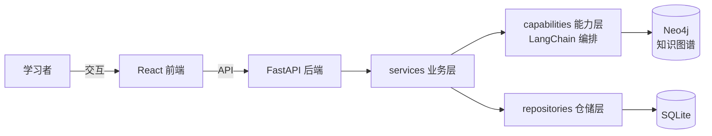

# TeacherAgent 项目启动：文档体系与技术栈定基

## 一、业务背景与目标

### 业务问题

新项目启动，需要先确立文档体系、项目基调、技术栈与 PRD，避免代码先行导致结构混乱。

### 已确认需求

- **产品定位**：全方位 IT 学习导师——整理笔记、制定教材、自定义和展示笔记、维护用户画像、长期运营的学习助手。
- **文档体系**：
  - `PRD.md`：业务方向唯一权威，不含具体实现。
  - `Arch.md`：项目层级（分前后端）、树形结构并注释职责。
  - `Design.md`：仅作为 Task.md 的前置草稿（讨论记录，定稿后迁移进代码与 README）。
  - 各路径 `README.md`：目录核心职责、已实现内容、代码偏好，含 mermaid。
  - `Task.md`：真正的任务规划载体（本文件）。
- **技术栈**：
  - 后端：Python（uv 管理）+ FastAPI + SQLite + LangChain + Neo4j。
  - 前端：React + Tailwind CSS。
  - `app.py`：一键启动前后端服务。

### 目标

1. 文档基调落盘：各文档仅含一级标题 + `> ` 文档注释（正文后续填充）。
2. 技术栈依赖安装完成（fastapi、langchain、neo4j 驱动等）。
3. `app.py` 可一键拉起前后端。

## 二、当前业务工作流（mermaid）

## 三、审查结论

- 现有 `teacheragent/` 目录已含 `api/ capabilities/ db/ graph/ repositories/ schemas/ services/` 分层骨架，与后端分层架构一致，予以保留。
- `pyproject.toml` 已有 pydantic；本轮补齐 fastapi、langchain、neo4j 等依赖。
- `frontend/` 为空目录，React + Tailwind 需初始化。
- `app.py` 为空文件，待实现一键启动。

## 四、非目标

- PRD 不含任何技术实现细节。
- Arch 不下钻到字段/接口级（细节归 Design 与代码）。
- README 只记事实，不记计划（计划归 Task.md）。
- 不做用户系统、多租户、部署运维（后续版本）。

## 五、待确认问题与风险

1. <todo> Neo4j 部署形态：本地 Docker 还是云托管？影响 `app.py` 一键启动范围。
2. <todo> LangChain 具体组件选型：langchain-core / langgraph？LLM 提供商与 API Key 管理。
3. <todo> SQLite 与 Neo4j 的数据分工边界：哪些数据入关系库、哪些入图库。
4. <todo> 前端构建器与包管理器：Vite + pnpm/npm？
5. <todo> 用户画像的数据模型与存储位置（SQLite 结构化 or Neo4j 图）。
6. <todo> 笔记格式标准：Markdown？是否引入富文本编辑器。

## 六、已确认口径

1. 产品定位：全方位 IT 学习导师（笔记整理、教材制定、笔记自定义展示、用户画像、长期运营）。
2. `Design.md` 仅作为 Task.md 的前置草稿，不承载定稿事实。
3. `PRD.md` 不含具体实现，只定业务方向。
4. 各目录 `README.md` 记录：核心职责、已实现内容、代码偏好，含 mermaid。
5. 技术栈：后端 Python + FastAPI + SQLite + LangChain + Neo4j；前端 React + Tailwind。
6. `Task.md` 是真正的任务规划文档（本文件）。
7. `app.py` 一键启动前后端服务。
8. 后端目录沿用现有 `teacheragent/` 分层（api / services / capabilities / repositories / db / graph / schemas）。

无阻塞项。

## 七、实施任务与依赖

### T1. 文档基调落盘（仅 `> ` 文档注释）

**意义**：确立各文档的基调与职责边界，后续内容按注释约束填充。

**状态**：【已完成。12 个文档已写入一级标题 + `> ` 文档注释，正文待后续任务填充】

**范围**：`PRD.md`、`Arch.md`、`Design.md`、根 `README.md`、`teacheragent/` 各子目录 `README.md`、`frontend/README.md`、`scripts/README.md`。

**验证结果**：12 个文档均已写入一级标题 + `> ` 文档注释（PRD/Arch/Design/根 README + teacheragent 7 个子目录 + frontend/scripts），无正文内容。

### T2. 后端依赖安装

**意义**：锁定技术栈，保证后续开发环境一致。

**状态**：【已完成。`uv add fastapi` 已执行；langchain、neo4j 待补】

**范围**：`pyproject.toml` 依赖：fastapi、uvicorn、langchain、langchain-core、neo4j。

**验收**：`uv sync` 通过，`uv run python -c "import fastapi, langchain, neo4j"` 无报错。

**验证结果**：

### T3. 前端初始化

**意义**：搭建 React + Tailwind 前端骨架。

**状态**：【未完成】

**范围**：`frontend/` 下初始化 Vite + React + TypeScript + Tailwind。

**验收**：`npm run dev` 可启动默认页面。

**验证结果**：

### T4. app.py 一键启动

**意义**：降低启动成本，一条命令拉起前后端。

**状态**：【未完成】

**范围**：`app.py` 并发启动 uvicorn（后端）与 vite dev（前端），含端口配置与退出清理。

**验收**：`uv run python app.py` 后前后端均可访问。

**验证结果**：

### T5. PRD 内容填充

**意义**：把产品定位细化为可执行的功能需求清单。

**状态**：【未完成】

**范围**：PRD §1–§5：定位、场景、功能需求（笔记整理/教材制定/笔记展示/用户画像/长期运营）、边界、约束。

**验收**：功能需求带编号与优先级；无技术词汇。

**验证结果**：

## 八、推荐执行顺序

T1 → T2 → T3 → T4 → T5（T2/T3 可并行；T5 可与 T3/T4 并行推进）。