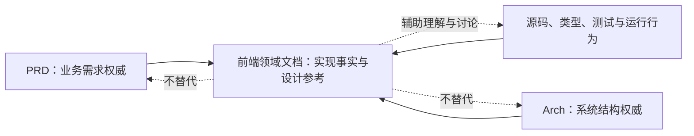

# 前端设计文档

> **性质**：文档编写规范。本文档属于治理性说明文档，用于记录已实现事实和设计参考，不构成独立的产品决策或强制设计方向。
> **核心理念**：文档服务于实现，而不是凌驾于实现；设计服务于问题，而不是服务于形式。

## 目标

- 为前端领域文档提供统一结构、语言、术语和更新规则。
- 使文档成为理解实现和讨论方案的辅助材料，而非脱离代码的第二套事实来源。

## 范围

- 本目录记录前端**领域模型**、**交互契约**、**数据约定**和**设计参考**。
- 文档按领域维护；跨领域内容通过引用关联，不复制另一篇文档的权威定义。
- 各文档可参考本 README 的推荐结构组织内容，但允许根据主题调整、合并或省略章节。

## 职责边界

- `PRD.md` 是业务需求权威；前端文档不替代或重新定义业务需求。
- `Arch.md` 是系统结构权威；前端文档只说明所属领域的结构与契约。
- 源码、类型、测试和运行行为是“当前实现”的最终依据；文档不得将未实现方案描述为现状。
- 前端领域文档可提出设计参考、备选方案和待确认问题，但不能单方面冻结产品视觉或交互方向。
- 各文档负责自身领域的命名族定义；

## Mermaid



## 具体规则

- 按“一领域一文档”方式组织，每篇文档在文首引用块中标注性质、依据
- **文首引用块**：每篇文档以一级标题开篇，紧随引用块说明文档性质、依据、维护时机和状态。
- **语言**：使用中文撰写，表达准确、克制，采用专业术语；核心概念保留英文，并在首次出现时用中文解释。后续统一使用同一术语，不随意中英切换。
- **命名族**：每篇领域文档在本篇定义自己的命名族：列出概念、标准名称、对象关系和易混边界。新增对象优先沿用该词族，不在全局文档中重复造名。
- **实现依据**：涉及实现事实时注明对应源码、类型、测试或契约文件；实现变化后同步更新事实描述。若文档与实现冲突，以代码及其验证行为为准，并修正文档。
- **Mermaid**：用于表达确有价值的对象关系、流程或职责边界；图中节点和箭头应与正文及当前状态一致。
- **可检查性**：规则应写成可检查的约束；建议、愿景和待确认事项不得伪装成验收要求。

### 领域文档模板

````markdown
# <领域主题>

> **性质**：<本文记录什么，以及是实现说明、设计参考或讨论稿。
> **依据**：<业务文档、源码、类型或测试。>

## 目标

- <说明本文希望解决的问题或读者需要获得的信息。>

## 范围

- <说明本文覆盖的对象、流程和场景。>
- <说明哪些相关内容由其他文档负责。>

## 职责边界

- <列出本文涉及的模块、数据或角色及各自责任。>
- <说明与相邻领域的输入、输出和边界。>

## Mermaid


<图应反映当前实现或明确标注为设计参考；不适用时说明原因。>

## 已确认口径

## 具体规则

### 当前实现

- <记录已由源码、类型、测试或运行行为证实的规则，并附对应路径。>

### <领域规则或设计参考>

- <将可选建议、待确认事项与已确认规则分开标注。>

### 命名族

| 概念 | 标准名称 | 含义与边界 |
|---|---|---|
| <概念> | `<EnglishName>` | <定义、关系及易混淆项。> |

## 非目标

- <明确本文不定义、不实现或不承诺的内容。>

## 验收标准

- <写出可检查的文档或实现条件；参考性理念不能写成强制验收项。>
````

### 命名族

以下概念在各篇文档中统一使用：

| 概念   | 标准名称                     | 含义与边界                                 |
| ---- | ------------------------ | ------------------------------------- |
| 领域文档 | `Domain Doc`             | 按领域维护的前端文档，是本文规范的适用对象；不替代 PRD 或 Arch。 |
| 当前实现 | `Current Implementation` | 已由源码、类型、测试或运行行为证实的事实；文档与代码冲突时以代码为准。   |
| 设计参考 | `Design Reference`       | 用于启发讨论的备选方案或设想；不代表已批准，不得写成现状。         |
| 待确认  | `Open Question`          | 尚未决策、需要讨论或等待输入的问题；不得伪装成规则。            |
| 命名族  | `Naming Family`          | 单篇文档内对领域概念、标准名称和易混边界的定义表；按领域各自维护。     |
| 验收标准 | `Acceptance Criteria`    | 可检查的条件；参考性理念不能写成强制验收项。                |

## 非目标

- 不要求所有前端设计文档形成新的架构或设计系统。
- 不以文档替代源码、类型检查、自动化测试或产品需求确认。
- 不将参考性理念解释为强制视觉风格、交互规范或技术选型。
- 不要求为没有稳定实现或决策依据的内容编造确定结论。

## 验收标准

- 本目录中的领域文档可参考推荐结构，并以适合主题的方式组织内容；中文专业表达和核心英文术语保持一致。
- 各文档在自身范围内定义命名族，并能指出实现依据或明确标记为设计参考。
- Mermaid 与正文、源码描述不矛盾；已变更实现的文档同步更新。
- 读者能够明确判断哪些内容已实现、哪些是参考、哪些仍待确认。
