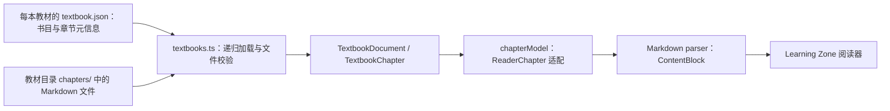

# 教科书设计理念

> **性质**：记录教材数据契约的当前实现与已确认目标，并提供教材内容设计参考。设计参考不构成强制写作规范；目标契约尚待代码迁移。**更新时机**：教材数据契约、解析能力或阅读器行为变化时。**状态**：当前实现事实持续维护；目标契约方向已确认、待迁移；设计参考待业务讨论。

## 目标

- 为教材内容组织、阅读连续性和学习支撑提供一组可讨论的设计依据。
- 说明当前前端教材的数据形态、文件约定、解析能力与职责边界，减少文档和实现脱节。
- 帮助后续教材内容生产在可读性、概念准确性和可验证性之间取得平衡。

## 范围

- 覆盖前端教材的目录元信息、章节 Markdown 文件、章节内大纲及 Markdown 内容块。
- 覆盖教材内容在前端的加载、解析和阅读器输入转换。
- 设计理念是参考而非指令；本文不规定每本教材必须采用同一教学结构、章节长度或视觉呈现。

## 职责边界

- 每本教材目录中的 `textbook.json` 声明该教材的书目信息、修订信息和有序章节目录。
- `frontend/mocks/textbooks.ts` 使用 Vite `import.meta.glob` 读取教材元信息和 Markdown，校验章节序号、登记文件与实际文件是否一致；它同时保留部分旧 mock 教材数据。
- `frontend/services/textbook/markdown/parser.ts` 将 Markdown 解析为 `ContentBlock`，负责语法映射和解析警告，不负责判断教学质量。
- `frontend/services/textbook/chapterModel.ts` 将正式的“一个 Markdown 文件对应一个章节”转换为阅读器统一输入，并兼容旧 `sections` 数据。
- `frontend/modules/learning-zone/` 消费教材文档并呈现阅读体验；它不负责定义教材生产流程或知识点事实。
- 教材与知识地图的关联、学习状态判定、Tutor 教学行为和内容生产审批不由本文或教材 Markdown 单独决定。

## 当前前端实现流程



## 具体规则

### 当前实现契约

- 教材内容位于 `frontend/mocks/textbook/`；每本教材以独立目录保存统一命名的 `textbook.json`。当前已取消全局教材 `manifest.json`。
- `textbook.json` 的 `chapters` 数组登记章节大纲及阅读顺序；每项只包含 `id`、`title`、`summary`。`id` 是两位纯数字字符串（如 `"01"`），代表章节序号，不单独保存 `fileName`。
- 章节文件名采用 `{NN}_{章节名}.md`，`NN_` 是固定的两位数字加下划线前缀，例如 `01_事件循环与异步模型.md`。加载器用 `id` 匹配文件名前缀，校验章节 ID 与顺序连续，并检查每个 ID 恰好匹配一个已登记文件、无未登记 Markdown 文件。
- `textbook.json` 至少包含 `id`、`title`、`subtitle`、`category`、`publishedAt`、`revisedAt`、`revision`、`status` 和 `chapters`；教材 `id` 使用带连字符的标准 UUID 格式，且所有教材 ID 必须唯一；日期使用 `YYYY-MM-DD`。
- `revision` 使用 `N1.N2.N3` 三段十进制非负整数，数字不使用前导零：`N1=0` 表示修订中，`N1>0` 表示正式版本；`N2` 是该主版本的发布序号，必须从 `1` 开始；`N3` 是该发布版本的修订次数，可以为 `0` 或大于 `9`。例如 `0.1.0` 表示修订中，`1.1.0` 表示正式版本的首次发布，`1.1.12` 表示该发布版本已修订 12 次。章节 `title` 和 `summary` 是 LLM 从章节内容解析后写入目录的展示信息，不单独生成章节文件。
- `code`、`edition`、`chapterCount`、`progress` 和 `theme` 不属于教材元信息契约，书架和阅读器均不读取；章节数如有需要从 `chapters` 数组计算。
- 部分旧 mock 教材的 `chapters` 目前为空，阅读器内容仍由 `textbooks.ts` 中的兼容样例生成；这类样例不是正式章节登记，不应与已登记 Markdown 章节混为一谈。
- 前后端可以共享 `textbook.json` 数据契约，但目前只有前端 mock loader 消费这些文件；后端接入及内容文件的共享部署位置/API 尚未实现。生产线 `PublicationManifest` 是另一种发布工件。
- 当前生成教材采用“一个 Markdown 文件 = 一个章节”。章节内使用 `##` 和 `###` 表达阅读大纲；阅读器测试将这两级标题作为当前目录层级约定。解析器会把更深层标题映射到三级标题展示，不应依赖更深层级表达额外目录深度。
- 解析器支持段落、标题、列表、引用、GFM 表格、公式、代码块、Mermaid、HTML、分隔线及 `info` / `tip` / `warning` directive。未知节点会产生 unsupported 内容或 warning；编写内容应优先使用已有支持语法。
- 当前沙盒 runtime 只为白名单中的 JavaScript 代码提供运行能力；其他语言代码可展示，但不应假设可执行。
- 旧 `sections` 是兼容字段，不是新教材内容的首选结构。正式教材内容应使用章节 Markdown；移除兼容逻辑前需先确认旧数据不再被消费。

### 教材命名族

| 概念 | 当前实现名称 | 语义与边界 |
|---|---|---|
| 教材元信息文件 | `textbook.json` | 单本教材的元信息、版本和章节目录；前后端可共享数据契约。 |
| 教材书目项 | `TextbookSummary` / `textbook.json` | 书架展示所需元信息，不承载完整章节正文。 |
| 教材文档 | `TextbookDocument` | 单本教材的完整前端文档，包含版本、书目元信息和章节集合。 |
| 章节 | `TextbookChapter` / `textbook.json` 的 `chapters[]` | 一个独立 Markdown 源文件及其展示元信息；不是章节内的标题。 |
| 旧版小节 | `TextbookSection` | 兼容数据形态，包含 `kind`、学习目标等结构化字段；新生成教材不以此为主要格式。 |
| 阅读器章节 | `ReaderChapter` | 阅读器输入适配模型；由 `chapterModel` 从正式章节或旧版小节转换而来。 |
| 内容块 | `ContentBlock` | Markdown parser 产出的渲染单元，例如 `heading`、`prose`、`code`、`formula`。 |
| 知识点 | `KnowledgePoint` | 知识地图中的独立内容实体，不等同于教材章节或标题；教材挂载关系需由知识地图契约定义。 |

当前教材元信息及大纲结构示例：

```json
{
	"id": "c7bb982f-4337-4738-95b9-0a04f6e45e4d",
	"title": "Python 异步进阶",
	"subtitle": "并发模型、结构化任务与可靠服务",
	"category": "计算机",
	"publishedAt": "2026-09-28",
	"revisedAt": "2026-09-28",
	"revision": "0.2.0",
	"status": "ready",
	"chapters": [
		{
			"id": "01",
			"title": "异步模型与事件循环",
			"summary": "理解 coroutine、Task 和 event loop 的关系。"
		}
	]
}
```

`Book → Chapter → ContentBlock` 是当前内容读取与呈现的主词族；`TextbookSection` 是历史兼容概念，`ReaderChapter` 是视图适配概念，二者不应与正式章节混称。章节内标题称为 heading，不称为独立教材章节。

### 设计参考：教科书理念

以下原则是后续内容设计的候选参考，不是已经批准的写作规范：

- **概念先行（Concept-first）**：先建立术语、问题和概念之间的关系，再引入公式或实现细节；是否采用应依据学科特点，而非机械套用。
- **渐进建构（Progressive elaboration）**：从直觉、定义、例子逐步过渡到边界条件和复杂应用，避免把先修知识当作默认背景。
- **解释与验证并置（Explanation and verification）**：在适合的主题中组合解释、例子、代码或公式，让读者能够检查推理；并非每节都必须附带可运行沙盒。
- **认知负荷管理（Cognitive load）**：一个段落或小节集中处理有限数量的新概念，通过回顾、对比和清晰标题帮助读者组织信息；实际粒度由内容复杂度决定。
- **准确性与可追溯性（Accuracy and provenance）**：事实、推导和示例应可核验；未来若接入教材生产线，应保留来源与审核信息，避免把生成文本默认为权威事实。
- **多路径理解（Multiple representations）**：适时组合自然语言、图表、公式、代码和例题；不同表示应互相解释，而不是仅作装饰。
- **可访问阅读（Accessible reading）**：关注标题顺序、表格可读性、代码说明、长内容分段和移动端呈现；具体无障碍标准需结合实际组件单独验收。

这些理念可用于评审教材内容，但不决定页面配色、排版风格、章节模板或交互形式。若未来形成强制写作规范，应另行确认并在内容契约、生产流程和测试中落地。

## 非目标

- 不将上述设计参考直接作为教材生产线的硬性提示词或审批规则。
- 不在本文冻结教材 UI 的视觉方向、页面布局或阅读交互。
- 不定义知识点抽取、学习状态、先修图谱、Tutor 策略或教学效果评价算法。
- 不把前端 `textbook.json` loader 描述为后端已接入的能力。
- 不因统一文档而一次性重构旧 mock、内容解析器或教材生产流程。

## 验收标准

- 文档清楚区分当前实现契约、兼容行为与设计参考，且每项实现事实能对应到源码或测试。
- 每本教材的书目、目录顺序和章节文件名登记于其 `textbook.json`；前端运行时能发现未登记或缺失的章节文件，并校验章节序号与目录顺序一致。
- Markdown 作者能够按已实现语法组织正文、章节标题和可选内容块，不依赖未支持的渲染行为。
- 教科书理念作为可讨论的参考存在，不被误读为已经批准的统一教学模板或视觉方向。
- 教材模型或解析能力变化时，同步更新命名族、规则和对应验证依据。
