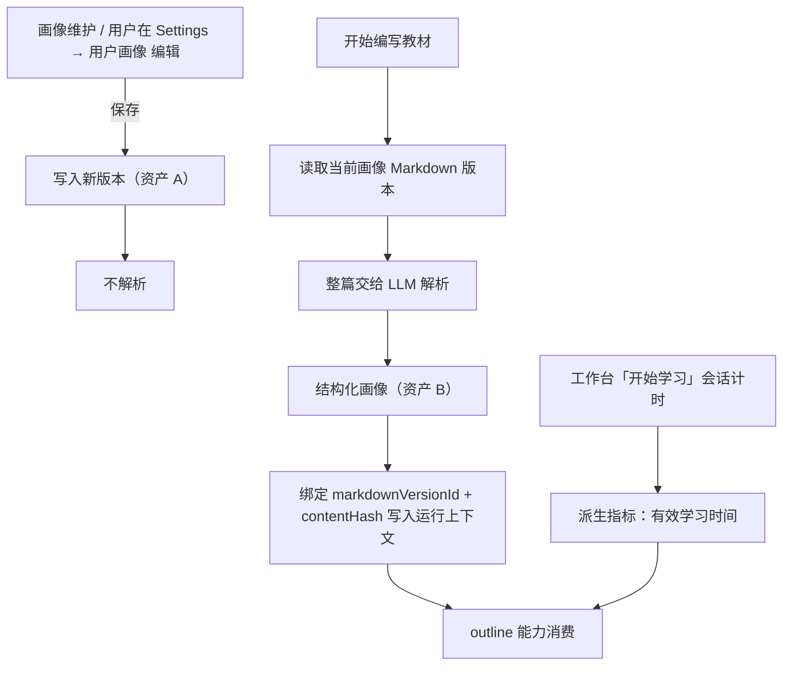

# 用户画像设计

> **性质**：用户画像域设计说明。定义画像的两类资产、Markdown 规范、结构化契约、解析时机与版本保留策略。
> 业务口径见 `PRD.md`「用户画像与长期运营」，分层归属见 `Arch.md`。

## 一、资产模型

画像域产出**两类资产**，两者不是并列关系，而是权威源与派生关系：

| 资产 | 载体 | 角色 | 写入方 | 消费者 |
|---|---|---|---|---|
| **A. 画像 Markdown** | 文本快照（SQLite 文本列） | **唯一权威源**，自然语言累积总结 | 画像维护 + 用户手动编辑 | 用户阅读与编辑、解析器 |
| **B. 结构化画像** | SQLite（可随时由 A 重建） | **派生资产**，机器可读 | 解析步骤（由 A 生成） | 大纲能力、后续画像消费点 |

关键原则：

1. **A 是权威，B 是派生**。B 不做独立编辑，也不与 A 双向同步 —— 双写必然产生冲突与漂移。
2. **A 用自然语言累积**，允许不精确、允许用户自由发挥；**B 必须结构完整**，可被契约校验。
3. B 可随时丢弃重建。任何时刻只要 A 还在，B 就能重新生成。
4. 用户改动的是 A；系统不把 B 回写进 A。

## 二、Markdown 规范（宽松规范）

设计目标与 skill 一致：**给骨架，不给强约束**。规范只保证可稳定切分，不限制用户怎么写内容。

### 2.1 硬约束（仅三条）

1. 用 `##` 二级标题作为**分区锚点**。
2. 分区标题取自受控词表（或别名）。
3. 分区内部为自由 Markdown —— 列表、表格、加粗、段落均可。

除此之外不设约束：分区顺序任意、允许缺失、允许增删、允许在文档头部写引言。

### 2.2 受控分区词表

| 规范名 | 结构化键 | 常见别名 | 说明 |
|---|---|---|---|
| 主修技术 | `primaryTech` | 主攻方向、主修 | 主攻方向与其水平，画像的锚点 |
| 技术栈 | `techStack` | 技能栈、技术背景 | **累积条目**，每条带水平；条目可整合 |
| 已学内容 | `learned` | 学过的内容、已学 | 具体学过什么，含学科内部细分 |
| 感兴趣 | `interests` | 兴趣、关注方向 | 想学的方向 |
| 学业背景 | `education` | 教育背景、专业背景 | 学业出身（如非计算机专业） |
| 职业背景 | `profession` | 工作背景 | 职业岗位与级别（**可选**，如数据分析师 / junior） |
| 学习目标 | `goals` | 目标、学习诉求 | 想达到什么、期限 |
| 薄弱点 | `weaknesses` | 易错点、待补强、短板 | 反复出错或明显薄弱的方面 |
| 学习偏好 | `preferences` | 学习习惯、节奏偏好 | 节奏与形式偏好 |

### 2.3 相对初版的修订

| 变化 | 理由 |
|---|---|
| **删除「学习轨迹」** | 太耦合：它把「学了什么」和「学习过程」混在一起。改为**已学内容**，只记学到的东西。 |
| **取消单列「当前水平」** | 水平是**每条技术条目的属性**，不是独立分区。`主修技术` + `技术栈` 的条目级水平共同承载 PRD 所说的「技术栈与当前水平」。 |
| **新增「主修技术」** | 用户可能横跨多个方向，需要一个锚点表达主攻，否则「会一点 Python + 会一点前端」无法区分主次。 |
| **新增「学业背景」** | 决定讲解深度与前置假设 —— 非计算机专业需要补基础概念，科班出身可以直接上术语。 |
| **新增「职业背景」（可选）** | 岗位与级别影响案例选型：数据分析师的并发需求与后端工程师的背景假设不同。 |
| **删除「可用学习时间」** | 不要求用户手写。**有效学习时间**改由行为记录计算（见 2.7）。 |

### 2.4 水平档位（定性，非打分）

技术条目可带水平档位。档位是**定性描述**，不是分数：

| 档位 | 含义 |
|---|---|
| 涉猎 | 接触过，未系统学习 |
| 入门 | 能照文档完成基础任务 |
| 会用 | 能独立完成常规任务 |
| 熟练 | 能处理边界情况与排障 |
| 进阶 | 能设计方案、优化与指导他人 |
| 精通 | 能定义领域实践、被同行认可。**很难达到，不要轻易标注** |

- **允许留空**：拿不准就不写档位，不硬凑。
- **禁止数值打分**（「80 分」「7/10」）：档位用于沟通，不用于评测。
- 档位名与档数可调整（见第七节）。

### 2.5 解析容错规则

| 情况 | 解析行为 |
|---|---|
| 分区缺失或为空 | 对应字段 `present: false`、`text: ""`，记 `warnings`，不报错 |
| 标题未命中词表 | 收进 `extras[]`，**不丢弃** |
| 同名分区重复 | 按出现顺序合并到同一字段 |
| 非 H2 的文档级内容 | 归入 `overview` |
| 分区内含表格 / 列表 | 原文保留在 `text`，`items[]` 另行抽取，不改写 |

**解析阶段只提取、不推断**。原文没写的，输出里不许有 —— 否则画像会被解析层的幻觉污染，并进一步污染大纲。

### 2.6 模板

```markdown
# 用户画像

## 主修技术

## 技术栈

## 已学内容

## 感兴趣

## 学业背景

## 职业背景

## 学习目标

## 薄弱点

## 学习偏好
```

### 2.7 示例

```markdown
# 用户画像

## 主修技术

Python（进阶）

## 技术栈

- Python（主修，进阶）：能独立设计后端服务与数据处理流程。
- NumPy / Pandas / Matplotlib（会用）：数据清洗、聚合与可视化。
- 机器学习（入门）：了解常见模型与评估方法。
- 深度学习（涉猎）：看过 CNN 与 Transformer 的基本原理。

## 已学内容

- 机器学习：线性回归、逻辑回归、决策树、聚类、模型评估。
- 网络爬虫：requests + BeautifulSoup。

## 感兴趣

前端、C++、Go

## 学业背景

非计算机专业。

## 职业背景

数据分析师（Data Scientist），junior。

## 学习目标

半年内具备独立设计高并发后端服务的能力，用于当前公司项目落地。

## 薄弱点

- 线程 / 协程模型混淆。
- 看到慢查询不知道从哪里下手。

## 学习偏好

偏好从动手示例入手，再做概念归纳。
```

### 2.8 累积与整合

`技术栈` 是**累积条目**：随学习推进不断追加，不要求一次写全。同时条目**可整合**：

- 同族条目可合并为一条，例如 `NumPy` / `Pandas` / `Matplotlib` → 「NumPy / Pandas / Matplotlib（会用）：数据清洗、聚合与可视化」。
- **整合只做归并，不丢信息**：原本的细分项写进该条的说明里。
- 整合由画像维护步骤发起，写入 Markdown 后由用户在编辑器确认（Markdown 是权威源）。

### 2.9 可计算指标（不写进 Markdown）

以下内容仅保留未来设计位置，**当前不实现、不采集、不计算、不消费**：

| 指标 | 未来来源（当前仅占位） | 单位 |
|---|---|---|
| 有效学习时间 | 工作台「开始学习」会话计时 | h（最小）/ day / month / year |

- 有效学习时间不设 Markdown 分区：它是暂未实现的派生指标。
- **当前范围**：不接会话计时，不计算聚合值，不落库，也不注入画像或大纲上下文。
- 未来若实现，消费方可直接读取派生指标，不依赖画像文本；具体口径另定。

### 2.10 前端编辑器约定

编辑器仍然是**宽松编辑器**（不做块编辑器、不锁结构），但提供轻量护栏：

- 保存前校验：核心分区被删除或标题被改动时给出**非阻塞提示**，由用户决定是否继续。
- 提供「插入分区」快捷操作，写入规范名标题，降低拼错概率。
- 提供**历史版本**入口：查看最近 2 份历史版本、diff 与「恢复」（恢复 = 复制旧版为新版本）。

## 三、结构化契约

### 3.1 结构

```jsonc
{
  "version": 2,
  "overview": { "present": false, "text": "" },
  "sections": {
    "primaryTech": { "present": true, "text": "Python（进阶）",
                     "items": [{ "name": "Python", "level": "进阶" }] },
    "techStack":   { "present": true, "text": "分区原文",
                     "items": [
                       { "name": "Python", "level": "进阶", "primary": true,
                         "note": "能独立设计后端服务与数据处理流程" },
                       { "name": "NumPy / Pandas / Matplotlib", "level": "会用",
                         "note": "数据清洗、聚合与可视化" }
                     ] },
    "learned":     { "present": true, "text": "分区原文",
                     "items": [{ "name": "机器学习",
                                 "note": "线性回归、逻辑回归、决策树、聚类、模型评估" }] },
    "interests":   { "present": true, "text": "前端、C++、Go",
                     "items": [{ "name": "前端" }, { "name": "C++" }, { "name": "Go" }] },
    "education":   { "present": true, "text": "非计算机专业。", "items": [] },
    "profession":  { "present": true, "text": "数据分析师（Data Scientist），junior。", "items": [] },
    "goals":       { "present": true, "text": "分区原文", "items": [] },
    "weaknesses":  { "present": true, "text": "分区原文",
                     "items": [{ "name": "线程 / 协程模型混淆" }] },
    "preferences": { "present": true, "text": "分区原文", "items": [] }
  },
  "extras": [],
  "warnings": [{ "code": "missing_section", "detail": "..." }]
}
```

**条目形状**（各分区统一）：

| 字段 | 必填 | 说明 |
|---|---|---|
| `name` | 是 | 条目名，必须是原文中出现的表述 |
| `level` | 否 | 水平档位，仅技术类条目使用 |
| `primary` | 否 | 是否主修方向 |
| `note` | 否 | 该条目的说明，取自原文 |

### 3.2 设计取舍

- **结构化到「分区 + 条目」两层，不强行拆到语义层**。`text` 保留分区原文，不把整段话拆成 `{ years: 3, tier: "进阶" }` 这类强 schema。文档由用户自由编辑，强 schema 必然频繁解析失败。
- **条目只做提取，不做推断**。`items[].name` 必须是原文出现过的表述；抽不出就返回空数组。
- **水平用受控档位而非自由文本**：它是唯一需要跨条目比较的字段。自由描述（「进阶」「比较熟」「还行」）无法比较，档位可以。
- **`warnings` 是给用户看的**，不是错误。它回答「哪些分区你还没写」。
- **来源信息不进结构化画像**：`markdownVersionId` 与 `contentHash` 由运行上下文携带，并随解析调用写入日志；解析时间以调用记录为准。

### 3.3 大纲能力侧的用法

| 画像字段 | 影响的大纲决策 |
|---|---|
| 主修技术 | 主线定位：以主修方向组织主线，其它技术作为支线 |
| 技术栈（条目级水平） | 起点难度；已会的技术不重复成章 |
| 已学内容 | 跳过已覆盖的细分主题，避免重复讲 |
| 感兴趣 | 拓展内容与案例选取 |
| 学业背景 | 术语深度与前置假设；非科班需要补基础概念 |
| 职业背景 | 案例选型与深度：岗位与级别决定例子贴近工作场景的程度 |
| 学习目标 | 覆盖范围与深度边界 |
| 薄弱点 | 需要加厚并配练习的章节 |
| 学习偏好 | 章节粒度与单章体量 |
| 有效学习时间（派生） | 体量与节奏的现实性校验 |

## 四、提示词

> **归属约定**：提示词统一归属到 `agent/prompts/`，由 Agent 入口按 `agent/prompts/<名称>.md` 加载。规范见 `src/teacheragent/docs/prompts.md`。

### 4.1 画像维护提示词

提示词资产：`agent/prompts/profile-maintain.md`

输入固定为「旧画像 Markdown + 本轮新的学习交互」，**不接收结构化画像**。职责：把本轮信息增量合并进画像 Markdown。核心约束：累积而非覆盖、只写有依据的结论、水平用档位而非分数、技术栈是累积条目且整合只做归并不丢信息。

### 4.2 画像解析提示词

提示词资产：`agent/prompts/profile-parse.md`

职责：把画像 Markdown **整篇**解析为结构化画像。核心约束：「只提取不推断」—— `items[].name` 必须是原文出现过的表述，原文没说的绝不补；分区缺失记入 `warnings` 而不报错。

> 提示词全文以 `agent/prompts/` 下的资产为**单一来源**，本文档不再维护副本，避免文档与资产漂移。
### 4.3 大纲能力消费约定

在 `outline` 能力域的角色设定中注入结构化画像，并附使用规则：

```markdown
## 学习者画像（由画像 Markdown 解析）

- 主修技术：…
- 技术栈：…
- 已学内容：…
- 感兴趣：…
- 学业背景：…
- 学习目标：…
- 薄弱点：…
- 学习偏好：…
- 解析告警：缺少「薄弱点」等分区（如有）

## 画像使用规则

- 以「主修技术」组织主线，其它技术作为支线，不平均用力。
- 起点难度以「技术栈」的条目级水平为下限：已会的技术不重复成章，最多作为前置回顾。
- 「已学内容」里出现过的细分主题不重复讲。
- 「薄弱点」对应章节加厚，并配练习与自测。
- 「学业背景」决定术语深度与前置假设；非科班背景需补基础概念。
- 「职业背景」决定案例选型：用贴近其岗位与级别的场景，不用超出其职责的假设。
- 「学习目标」决定覆盖边界，超出目标的内容不进大纲。
- 「感兴趣」决定拓展内容与案例选取。
- 「学习偏好」决定章节粒度与单章体量。
- 画像中缺失的分区**不得臆测**：需要用户补充时，在输出中标注「该假设待确认」，由人工审批节点兜底。
```

## 五、解析时机与流程



要点：

1. **编辑与解析解耦**：保存不触发解析，避免用户每敲一次都跑一遍模型。
2. **解析只发生在开始编写教材时**（对应 content-pipeline 的上下文快照 / 大纲节点之前）。可另提供「预览解析结果」手动入口，但不自动执行。
3. **解析产物必须携带来源版本 ID 与内容哈希**，写入运行上下文，供教材溯源。
4. **派生指标与画像分开**：有效学习时间来自工作台的学习会话计时，不进 Markdown、不进结构化画像的 `sections`，作为独立输入并列注入。
5. 解析失败时**不静默降级**：应中断教材流程并提示用户修正 Markdown，或明确告知「画像未纳入本次生成」。

## 六、版本与保留策略

- 每次保存产生一个新版本：`user_profiles` 表新增一行，内容为 Markdown 全文快照。
- 版本标识：**`id = <user_key>-<时间戳>`**，例如 `admin-20260914123000`。`user_key` 作为前缀，便于按归属识别与排序。
- 时间戳**精确到秒**（UTC）。接受同一秒内连续保存会撞 `id` 的极端情况 —— 实际保存之间总有时间差，不做序号或毫秒级补偿。
- 单用户场景：`user_key` 默认 `admin`。
- **当前版本 = 同一 `user_key` 下 `created_at` 最大的那行**。不设 `is_current` 列，避免额外的一致性维护。
- 保留窗口：每个 `user_key` 最多 3 行（当前 1 份 + 历史 2 份）。写入新版本后按 `created_at` 倒序滚动删除，**无条件删除**。
- 保留份数写成常量（历史份数 = 2），不散落在业务代码里。
- 「恢复」= **复制旧版本内容为新版本**，不原地回滚，保证版本序列只增不减。

数据形态：

| 列 | 类型 | 说明 |
|---|---|---|
| `id` | TEXT PRIMARY KEY | `<user_key>-<时间戳>`，如 `admin-20260914123000` |
| `user_key` | TEXT NOT NULL DEFAULT 'admin' | 用户标识；单用户默认 `admin` |
| `content` | TEXT NOT NULL | 画像 Markdown 全文快照 |
| `content_hash` | TEXT NOT NULL | 内容哈希 |
| `created_at` | TEXT NOT NULL DEFAULT (datetime('now')) | 创建时间 |

索引：`(user_key, created_at DESC)`，支撑「取当前版本」与「滚动删除」。

已知取舍：时间戳精确到秒，理论上同一秒内连续保存会撞 `id`。**经确认接受该风险**：不做序号或毫秒级处理，避免过度设计。

## 七、待确认

1. [待确认]。**受控分区词表**是否还需增补？当前 9 个分区，其中「职业背景」为可选。
2. [待确认]。**有效学习时间的计算口径**：按下「结束学习」才结算，还是按页面前台活跃时间自动累计？以及 h / day / month / year 的聚合阈值。
3. [待确认]。**工作台首页的定位**：它是「实际首页」，需要确认它与现有左侧导航（知识地图 / 书架 / 学习区 / 教材生产线 / 笔记 / 设置）的关系 —— 替换默认落地页，还是新增一级入口。
4. [待确认]。**`behavior_logs` 的写入时机与粒度**：未定义，先行落地可能产生噪声数据。
5. [待确认]。**两类资产的解读**：Markdown 权威源 + 结构化派生。若「两类资产」指两条业务线，Markdown 规范可按同一切分方式拆成两份文档。

