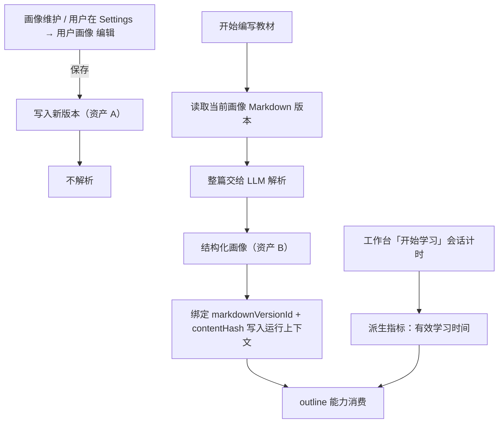

# 用户画像设计

> **性质**：用户画像域设计说明。定义画像的两类资产、Markdown 规范、结构化契约、解析时机与版本保留策略。
> 业务口径见 `PRD.md`「用户画像与长期运营」，分层归属见 `Arch.md`。

## 一、资产模型

画像域产出**两类资产**，两者不是并列关系，而是权威源与派生关系：

| 资产 | 载体 | 角色 | 写入方 | 消费者 |
|---|---|---|---|---|
| **A. 画像 Markdown** | 文本快照（SQLite 文本列） | **唯一权威源**，自然语言累积总结 | 画像维护 + 用户手动编辑 | 用户阅读与编辑、解析器 |
| **B. 结构化画像** | SQLite（可随时由 A 重建） | **派生资产**，机器可读 | 解析步骤（由 A 生成） | 大纲能力、后续画像消费点 |

关键原则：

1. **A 是权威，B 是派生**。B 不做独立编辑，也不与 A 双向同步 —— 双写必然产生冲突与漂移。
2. **A 用自然语言累积**，允许不精确、允许用户自由发挥；**B 必须结构完整**，可被契约校验。
3. B 可随时丢弃重建。任何时刻只要 A 还在，B 就能重新生成。
4. 用户改动的是 A；系统不把 B 回写进 A。

## 二、Markdown 规范（宽松规范）

设计目标与 skill 一致：**给骨架，不给强约束**。规范只保证可稳定切分，不限制用户怎么写内容。

### 2.1 硬约束（仅三条）

1. 用 `##` 二级标题作为**分区锚点**。
2. 分区标题取自受控词表（或别名）。
3. 分区内部为自由 Markdown —— 列表、表格、加粗、段落均可。

除此之外不设约束：分区顺序任意、允许缺失、允许增删、允许在文档头部写引言。

### 2.2 受控分区词表

分区分为两组。**技术**记录能力事实，**用户背景**记录影响教学决策的事实。分组只用于阅读与文档组织，不进入输出结构：结构化画像与 Markdown 都是扁平分区。

**技术**

| 规范名 | 结构化键 | 常见别名 | 说明 |
|---|---|---|---|
| 主修技术 | `primaryTech` | 主攻方向、主修 | 用户主要掌握、需要精通的技术；主线定位的锚点 |
| 技术栈 | `techStack` | 技能栈、技术背景 | 已知技术的全量清单，每条带水平；条目可整合 |

**用户背景**

| 规范名 | 结构化键 | 常见别名 | 说明 |
|---|---|---|---|
| 学业背景 | `education` | 教育背景、专业背景 | 学历、专业、院校与院校层次；按原文提取，不拆固定子字段 |
| 职业背景 | `profession` | 工作背景 | 岗位与职级；按原文提取 |
| 已学内容 | `learned` | 学过的内容、已学 | 已覆盖的主题或范围；「学过」不等于「掌握」 |
| 学习目标 | `goals` | 目标、学习诉求 | 想学成的方向与结果 |
| 学习偏好 | `preferences` | 学习习惯、节奏偏好 | 节奏与形式偏好 |

`主修技术` 与 `技术栈` 不是互斥清单：主修只列需要精通的技术，技术栈保留全量。同一技术可同时出现在两处，解析时不因重复而丢弃任一处。

### 2.3 相对初版的修订

| 变化 | 理由 |
|---|---|
| **「已学内容」`learned` 归入用户背景** | 它回答「覆盖过哪些主题」，与技术栈的能力水平不是同一事实：技术栈说会到什么程度，已学内容说学过哪些范围。作为字符串数组放在用户背景组，供大纲避免重复讲已覆盖的主题。 |
| **删除「薄弱点」`weaknesses`** | 薄弱点要跨多次学习行为才能确认，画像文本没有可靠的更新来源，写进去就会长期过期。 |
| **删除「感兴趣」`interests`** | 与「学习目标」重复，两者都表达想学的方向；目标多了「达成」语义，是更强的表达。 |
| **移除条目 `primary` 字段** | 「主修技术」分区本身就是主修清单，再带 `primary` 是同一事实的第二处表达。 |
| **移除 `present` / `text` / `items` 包装** | 缺失用 `null` 表达，有内容就是条目数组；理由见 3.2。 |
| **背景分区不定固定子字段** | 学业与职业背景由用户自由书写，定死 `degree` / `major` / `school` 会在换一种写法时解析失败，或让解析器把一句话拆成不确定的字段。 |
| **分区分为「技术」与「用户背景」两组** | 两组职责不同：技术是能力事实，用户背景是教学决策事实；分组只用于阅读顺序，不进入输出结构。 |

### 2.4 水平档位（定性，非打分）

技术条目可带水平档位。档位是**定性描述**，不是分数：

| 档位 | 含义 |
|---|---|
| 涉猎 | 接触过，未系统学习 |
| 入门 | 能照文档完成基础任务 |
| 会用 | 能独立完成常规任务 |
| 熟练 | 能处理边界情况与排障 |
| 进阶 | 能设计方案、优化与指导他人 |
| 精通 | 能定义领域实践、被同行认可。**很难达到，不要轻易标注** |

- **允许留空**：拿不准就不写档位，不硬凑。
- **禁止数值打分**（「80 分」「7/10」）：档位用于沟通，不用于评测。
- 档位名与档数可调整（见第七节）。

### 2.5 解析容错规则

| 情况 | 解析行为 |
|---|---|
| 分区缺失或为空 | 该分区为 `null`，不报错 |
| 标题未命中词表 | 收进 `extras[]`，**不丢弃** |
| 同名分区重复 | 按出现顺序合并到同一分区 |
| 非 H2 的文档级内容 | 收进 `extras[]`，`title` 为空 |
| 分区内含表格 / 列表 | 按分区结构抽取条目，不改写原文 |

**解析阶段只提取、不推断**。原文没写的，输出里不许有 —— 否则画像会被解析层的幻觉污染，并进一步污染大纲。

解析产物不保存分区原文。Markdown 是权威源，需要核对原文时读取 Markdown 或调用日志，不在结构化画像里再存一份。

### 2.6 模板

```markdown
# 用户画像

## 主修技术

## 技术栈

## 学业背景

## 职业背景

## 已学内容

## 学习目标

## 学习偏好
```

### 2.7 示例

```markdown
# 用户画像

## 主修技术

Python（进阶）

## 技术栈

- Python（进阶）：后端服务与数据处理流程。
- NumPy / Pandas / Matplotlib（会用）：数据清洗、聚合与可视化。
- React（熟练）：组件与状态管理。

## 学业背景

本科，非计算机专业。

## 职业背景

数据分析师（Data Scientist），junior。

## 已学内容

- 机器学习：线性回归、决策树、模型评估。
- 网络爬虫：requests + BeautifulSoup。

## 学习目标

半年内具备独立设计高并发后端服务的能力，用于当前公司项目落地。

## 学习偏好

偏好从动手示例入手，再做概念归纳。
```

### 2.8 累积与整合

`技术栈` 是**累积条目**：随学习推进不断追加，不要求一次写全。同时条目**可整合**：

- 同族条目可合并为一条，例如 `NumPy` / `Pandas` / `Matplotlib` → 「NumPy / Pandas / Matplotlib（会用）：数据清洗、聚合与可视化」。
- **整合只做归并，不丢信息**：原本的细分项写进该条的说明里。
- 整合由画像维护步骤发起，写入 Markdown 后由用户在编辑器确认（Markdown 是权威源）。

### 2.9 可计算指标（不写进 Markdown）

以下内容仅保留未来设计位置，**当前不实现、不采集、不计算、不消费**：

| 指标 | 未来来源（当前仅占位） | 单位 |
|---|---|---|
| 有效学习时间 | 工作台「开始学习」会话计时 | h（最小）/ day / month / year |

- 有效学习时间不设 Markdown 分区：它是暂未实现的派生指标。
- **当前范围**：不接会话计时，不计算聚合值，不落库，也不注入画像或大纲上下文。
- 未来若实现，消费方可直接读取派生指标，不依赖画像文本；具体口径另定。

### 2.10 前端编辑器约定

编辑器仍然是**宽松编辑器**（不做块编辑器、不锁结构），但提供轻量护栏：

- 保存前校验：核心分区被删除或标题被改动时给出**非阻塞提示**，由用户决定是否继续。
- 提供「插入分区」快捷操作，写入规范名标题，降低拼错概率。
- 提供**历史版本**入口：查看最近 2 份历史版本、diff 与「恢复」（恢复 = 复制旧版为新版本）。

## 三、结构化契约

### 3.1 结构

```jsonc
{
  "version": 3,

  // 技术：能力事实，每条一个技术条目
  // 主修：需要精通的技术，是技术栈的子集
  "primaryTech": [
    { "name": "Python", "level": "精通", "note": "后端服务与数据处理流程" }
  ],
  // 技术栈：已知技术的全量清单
  "techStack": [
    { "name": "Python", "level": "精通", "note": "后端服务与数据处理流程" },
    { "name": "NumPy / Pandas / Matplotlib", "level": "会用",
      "note": "数据清洗、聚合与可视化" },
    { "name": "React", "level": "熟练", "note": "组件与状态管理" }
  ],

  // 用户背景：教学决策事实
  // 学业与职业：一句原文表述
  "education": "本科，非计算机专业，就读于某 211 院校。",
  "profession": "数据分析师，junior。",
  // 已学内容、目标与偏好：每条一个字符串
  "learned": ["线性回归、决策树与模型评估", "requests + BeautifulSoup"],
  "goals": ["半年内具备独立设计高并发后端服务的能力"],
  "preferences": ["动手示例先行，再做概念归纳。"],

  // 未命中受控分区的原文，保留不丢
  "extras": []
}
```

分区缺失写 `null`，不用空字符串或空数组占位：

```jsonc
{
  "primaryTech": [ ... ],
  "techStack": [ ... ],
  "education": null,
  "profession": "数据分析师，junior。",
  "learned": null,
  "goals": null,
  "preferences": null
}
```

**字段说明**：

| 字段 | 类型 | 说明 |
|---|---|---|
| `primaryTech` | 条目数组 | 每条含 `name`，可含 `level` 与 `note` |
| `techStack` | 条目数组 | 同上 |
| `education` | 字符串 | 学业背景的一句原文表述 |
| `profession` | 字符串 | 职业背景的一句原文表述 |
| `learned` | 字符串数组 | 每条一个已学主题或范围；「学过」不等于「掌握」 |
| `goals` | 字符串数组 | 每条一个学习目标 |
| `preferences` | 字符串数组 | 每条一个学习偏好 |
| `extras` | 对象数组 | `title` 为分区标题（不是分区时为 `null`），`text` 为原文 |

条目字段（仅技术分区使用）：`name` 必填；`level` 为水平档位，仅在原文可对应到档位时填写；`note` 为该条的原文说明。

### 3.2 设计取舍

**为什么不用 `{ present, text, items }`。** 旧结构给每个分区套同一层包装，同时存「是否存在」、「分区原文」和「抽取条目」三件事。它有四个问题：

1. **三重表达同一事实。** 分区缺失时 `present: false`、`text: ""`、`items: []` 同时成立，正确性靠三者保持一致来维持。
2. **`text` 与权威源重复。** Markdown 是权威源且永久保留；解析产物再存一份分区原文，等于同一事实两处存储，还会随每次注入重复送进模型。
3. **`text` 没有消费者。** 下游读的是条目；`text` 只当审查线索，而审查可以直接看 Markdown 和调用日志。
4. **形状不合理。** 背景与目标本可以直接是字符串或字符串列表，却被迫和条目分区共用同一种包装，再挂上永为空的子字段。

**现在的规则。** 缺失用 `null`；每个分区用与内容相称的最简类型：技术是条目数组（需要名称与水平），学业与职业是一句原文，已学内容、目标与偏好是字符串数组。

**背景不做强结构。** 学业与职业背景由用户自由书写（「本科，非计算机专业，就读于某 211」），定死 `degree` / `major` / `school` / `tags` 会两种后果：用户换一种写法就解析失败，或者解析器把一句话拆成多个它并不确定的字段。所以背景保留为一句原文，结构层不替用户归类。

**保留的取舍：**

- **水平用受控档位而非自由文本**：它是唯一需要跨条目比较的字段。自由描述（「比较熟」「还行」）无法比较，档位可以。
- **条目只做提取，不做推断**：`name` 必须是原文出现过的表述。
- **`extras` 保留未知分区**：避免用户写了新分区却被丢弃；它默认不参与大纲决策。
- **不设 `warnings`**：哪些分区没写，从字段是否为 `null` 直接可读；再存一份告警是同一事实的第二处表达。
- **来源信息不进结构化画像**：版本 ID 与内容哈希由运行上下文携带，并随解析调用写入日志。

### 3.3 大纲能力侧的用法

| 画像字段 | 影响的大纲决策 |
|---|---|
| `primaryTech` | 主线定位：以主修方向组织主线，其它技术作为支线 |
| `techStack`（条目级水平） | 起点难度：高于起点的内容压缩为回顾，低于起点的内容展开 |
| `education` | 术语深度与前置假设；非科班背景需补基础概念 |
| `profession` | 案例选型与深度：用贴近其岗位与职级的场景 |
| `learned` | 跳过已覆盖的主题，避免重复讲；它不是掌握度证明，不得据此压缩必修能力 |
| `goals` | 覆盖范围与深度边界 |
| `preferences` | 章节粒度、学习活动形式与单章体量 |
| `extras` | 默认不读；经人工确认后才作为补充输入 |

## 四、提示词

> **归属约定**：提示词统一归属到 `agent/prompts/`，由 Agent 入口按 `agent/prompts/<名称>.md` 加载。规范见 `src/teacheragent/docs/prompts.md`。

### 4.1 画像维护提示词

提示词资产：`agent/prompts/profile-maintain.md`

输入固定为「旧画像 Markdown + 本轮新的学习交互」，**不接收结构化画像**。职责：把本轮信息增量合并进画像 Markdown。核心约束：累积而非覆盖、只写有依据的结论、水平用档位而非分数、技术栈是累积条目且整合只做归并不丢信息。

### 4.2 画像解析提示词

提示词资产：`agent/prompts/profile-parse.md`

职责：把画像 Markdown **整篇**解析为结构化画像。核心约束：「只提取不推断」—— `name` 必须是原文出现过的表述，原文没说的绝不补；分区缺失写 `null`，不报错也不臆测。

> 提示词全文以 `agent/prompts/` 下的资产为**单一来源**，本文档不再维护副本，避免文档与资产漂移。
### 4.3 大纲能力消费约定

在 `outline` 能力域的角色设定中注入结构化画像，并附使用规则：

```markdown
## 学习者画像（由画像 Markdown 解析）

**技术**：
- 主修：…
- 技术栈：名称（档位）…

**用户背景**：
- 学业背景：…
- 职业背景：…
- 已学内容：…
- 学习目标：…
- 学习偏好：…

## 画像使用规则

- 以「主修」组织主线，其它技术作为支线，不平均用力。
- 起点难度以「技术栈」的条目级水平为准：高于起点的压缩为回顾，低于起点的展开。
- 「学业背景」决定术语深度与前置假设；非科班背景需补基础概念。
- 「职业背景」决定案例选型：用贴近其岗位与职级的场景，不用超出其职责的假设。
- 「已学内容」已覆盖的主题不重复讲；但它不是掌握度证明，必修能力不因「学过」而跳过。
- 「学习目标」决定覆盖边界，超出目标的内容不进大纲。
- 「学习偏好」决定章节粒度、学习活动形式与单章体量。
- 画像中缺失的分区（字段为 `null`）**不得臆测**：需要用户补充时，在输出中标注「该假设待确认」，由人工审批节点兜底。
```

## 五、解析时机与流程


```mermaid
flowchart TD
    A["画像维护 / 用户在 Settings → 用户画像 编辑"] -->|保存| B["写入新版本（资产 A）"]
    B --> C["不解析"]
    D["开始编写教材"] --> E["读取当前画像 Markdown 版本"]
    E --> F["整篇交给 LLM 解析"]
    F --> G["结构化画像（资产 B）"]
    G --> H["绑定 markdownVersionId + contentHash 写入运行上下文"]
    H --> I["outline 能力消费"]
    J["工作台「开始学习」会话计时"] --> K["派生指标：有效学习时间"]
    K --> I
```

要点：

1. **编辑与解析解耦**：保存不触发解析，避免用户每敲一次都跑一遍模型。
2. **解析只发生在开始编写教材时**（对应 content-pipeline 的上下文快照 / 大纲节点之前）。可另提供「预览解析结果」手动入口，但不自动执行。
3. **解析产物必须携带来源版本 ID 与内容哈希**，写入运行上下文，供教材溯源。
4. **派生指标与画像分开**：有效学习时间来自工作台的学习会话计时，不进 Markdown、不进结构化画像分区，作为独立输入并列注入。
5. 解析失败时**不静默降级**：应中断教材流程并提示用户修正 Markdown，或明确告知「画像未纳入本次生成」。

## 六、版本与保留策略

- 每次保存产生一个新版本：`user_profiles` 表新增一行，内容为 Markdown 全文快照。
- 版本标识：**`id = <user_key>-<时间戳>`**，例如 `admin-20260914123000`。`user_key` 作为前缀，便于按归属识别与排序。
- 时间戳**精确到秒**（UTC）。接受同一秒内连续保存会撞 `id` 的极端情况 —— 实际保存之间总有时间差，不做序号或毫秒级补偿。
- 单用户场景：`user_key` 默认 `admin`。
- **当前版本 = 同一 `user_key` 下 `created_at` 最大的那行**。不设 `is_current` 列，避免额外的一致性维护。
- 保留窗口：每个 `user_key` 最多 3 行（当前 1 份 + 历史 2 份）。写入新版本后按 `created_at` 倒序滚动删除，**无条件删除**。
- 保留份数写成常量（历史份数 = 2），不散落在业务代码里。
- 「恢复」= **复制旧版本内容为新版本**，不原地回滚，保证版本序列只增不减。

数据形态：

| 列 | 类型 | 说明 |
|---|---|---|
| `id` | TEXT PRIMARY KEY | `<user_key>-<时间戳>`，如 `admin-20260914123000` |
| `user_key` | TEXT NOT NULL DEFAULT 'admin' | 用户标识；单用户默认 `admin` |
| `content` | TEXT NOT NULL | 画像 Markdown 全文快照 |
| `content_hash` | TEXT NOT NULL | 内容哈希 |
| `created_at` | TEXT NOT NULL DEFAULT (datetime('now')) | 创建时间 |

索引：`(user_key, created_at DESC)`，支撑「取当前版本」与「滚动删除」。

已知取舍：时间戳精确到秒，理论上同一秒内连续保存会撞 `id`。**经确认接受该风险**：不做序号或毫秒级处理，避免过度设计。

## 七、待确认

1. [待确认]。**受控分区词表**是否还需增补？当前 9 个分区，其中「职业背景」为可选。
2. [待确认]。**有效学习时间的计算口径**：按下「结束学习」才结算，还是按页面前台活跃时间自动累计？以及 h / day / month / year 的聚合阈值。
3. [待确认]。**工作台首页的定位**：它是「实际首页」，需要确认它与现有左侧导航（知识地图 / 书架 / 学习区 / 教材生产线 / 笔记 / 设置）的关系 —— 替换默认落地页，还是新增一级入口。
4. [待确认]。**`behavior_logs` 的写入时机与粒度**：未定义，先行落地可能产生噪声数据。
5. [待确认]。**两类资产的解读**：Markdown 权威源 + 结构化派生。若「两类资产」指两条业务线，Markdown 规范可按同一切分方式拆成两份文档。

