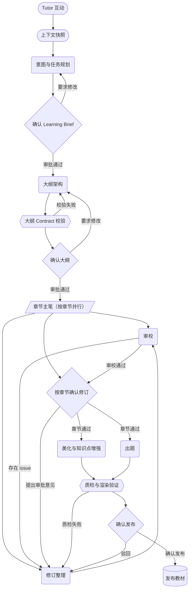

# 教材生产线（content-pipeline）

## 职责

编排教材生产主流程：Tutor 上下文 → 结构化大纲 → 章节内容 → 审校修订 → 美化出题 → 质检发布。

workflow id `content-pipeline-main`，版本 1，入口节点 `tutor-trigger`。

## 后端资产

| 文件 | 内容 |
|---|---|
| `definition.py` | 主流程图定义：16 个节点、25 条连线、入口 `tutor-trigger`；导入即注册 |
| `artifacts.py` | 端口可用的产物类型词表（10 个），与前端 `contentPipelineArtifactTypes` 同值 |

节点 id 与前端 content-pipeline canvas 一一对应，是运行记录归属节点的 join key。
图定义不含内容：产物正文由执行器落进 `node_artifacts`，载荷的契约校验随各角色的实现一起补（目前只有 `outline-architect` 有实现，所以一次真实运行会停在 `intent-planner`）。

## 固定路线

形状对应工序类型：胶囊 = 入口/上下文，圆角 = `agent`，菱形 = 人工门禁，六边形 = `contract-gate`，平行四边形 = `fan-out`，圆柱 = `persist`。

节点按工序类型分布：

| 节点类型 | 数量 | 节点 |
|---|---|---|
| `trigger` | 1 | `tutor-trigger` |
| `context` | 1 | `context-snapshot` |
| `agent` | 6 | `intent-planner`、`outline-architect`、`reviewer`、`reviser`、`beautifier`、`assessment-generator` |
| `fan-out` | 1 | `chapter-writers`（按章节并行，`concurrency: 4`） |
| `contract-gate` | 2 | `outline-contract-gate`、`quality-gate` |
| `human-gate` | 4 | `brief-approval`、`outline-approval`、`chapter-approval`、`publish-approval` |
| `persist` | 1 | `publisher` |

6 个 `agent` 节点各带 `promptRef`；4 个人工门禁节点各自声明 `humanApproval` 的审批范围（`workflow`、`outline`、`chapter`、`publish`）。

4 个人工门禁与 2 个契约门的每个输出端口都产出 `GateReview`：评审主体（`ai` / `user`）、通过与否、修订意见，并用 `contentHash` 指向被审内容的正文行。门禁因此不需要「放行」机制：它写自己的评估行，下游按内容身份取被审内容。`quality-gate` 例外地多一个 `manifest` 端口，出版它真正产出的发布清单；`publisher` 的 `published` 端口是同一份清单的落库产出。
`chapter-writers` 是 `fan-out`：一位章节主笔负责一整个章节（一个 OutlineItem），`concurrency: 4` 是并行度、不是主笔数量；该角色的提示词资产 `agent/prompts/chapter-writer.md` 待编写。

## 提示词

节点的 `promptRef` 用与 `load_prompt()` 同一命名空间的资产路径 `agent/prompts/<名称>.md`，资产正文按 ref 现取。
当前只有 `outline-architect.md` 已存在，其余 5 份（`intent-planner`、`reviewer`、`reviser`、`beautifier`、`assessment-generator`）待编写。

## 当前后端 Agent 边界

Tutor 通过工具调用型 Agent 提供学习上下文和知识地图查询。
能力域只提供可复用的输入 → 输出逻辑，本目录的图定义是被推进的对象，不是执行器：执行器在 `workflows/execution/`（发起入口是它的 `start_run`），`agent/` 内不再有课程设计图。

## 边界

- 不实现通用 Agent runtime。
- 不把知识地图注册为独立 Agent role。
- 不在本目录维护角色 `settings.md` 或分散提示词副本。
